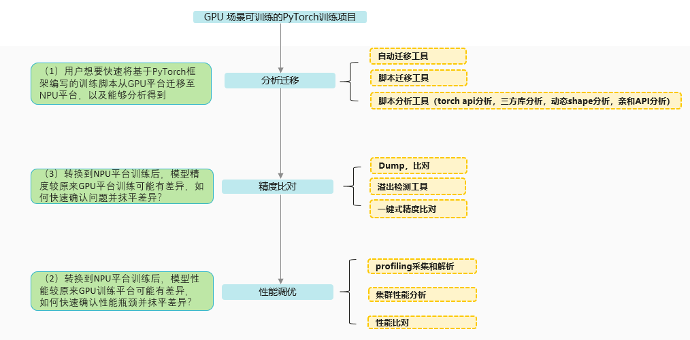

# att

#### 介绍
Ascend Training Tools，昇腾训练工具链
针对训练&大模型场景，提供端到端命令行&可视化调试调优工具，帮助用户快速提高模型开发效率

#### 模型训练迁移全流程

#### 使用说明

1.  训练脚本工具[tools](https://gitee.com/ascend/att/tree/master/debug/tools)

    a. [custom](http://https://gitee.com/ascend/att/tree/master/debug/tools/custom)

        **社区用户贡献工具**：用户可提交自己的脚本代码及使用说明，规则：创建新的文件夹xxx_tool, 下面放脚本文件及相关文件以及README

    b. [compare_tools](https://gitee.com/ascend/att/tree/master/debug/tools/compare_tools)

        **GPU与NPU性能比较工具**：提供NPU与GPU算子性能的比较功能。

    c. [distribute_tools](http://https://gitee.com/ascend/att/tree/master/debug/tools/distribute_tools)

        **集群场景脚本集合**：提供集群场景数据一键汇聚功能和一键修改各机hostname功能。

    d. [merge_profiling_timeline](https://gitee.com/ascend/att/tree/master/debug/tools/merge_profiling_timeline)

        **合并大json工具**：融合多个profiling的timeline在一个json文件中的功能。

    e. [profiling analysis](https://gitee.com/ascend/att/tree/master/debug/tools/profiling_analyse)

        **性能拆解工具**：提供GPU与NPU的性能分析拆解能力。
    
2.  tensorboard支持npu可视化插件[tb-plugin](https://gitee.com/ascend/att/tree/master/plugins/tensorboard-plugins/tb_plugin)

    **PyTorch profiling数据可视化的TensorBoard的插件**： 它支持将Ascend平台采集、解析的Pytorch Profiling数据可视化呈现，也兼容GPU数据采集、解析可视化。

#### 参与贡献

1.  Fork 本仓库
2.  新建 xxx 分支
3.  提交代码
4.  新建 Pull Request

