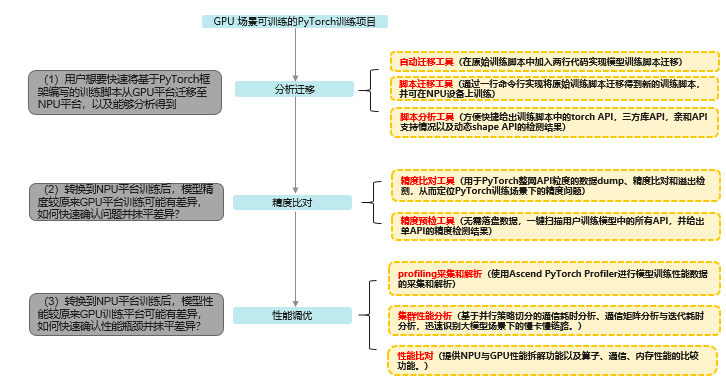

# ATT

Ascend Training Tools，昇腾训练工具链。针对训练&大模型场景，提供端到端命令行&可视化调试调优工具，帮助用户快速提高模型开发效率。

## 模型训练迁移全流程

## 使用说明

### [分析迁移工具](https://gitee.com/ascend/att/wikis/%E5%B7%A5%E5%85%B7%E4%BB%8B%E7%BB%8D/%E5%88%86%E6%9E%90%E8%BF%81%E7%A7%BB%E5%B7%A5%E5%85%B7/%E5%88%86%E6%9E%90%E8%BF%81%E7%A7%BB%E5%B7%A5%E5%85%B7%E4%BB%8B%E7%BB%8D)

1. [脚本分析工具](https://gitee.com/ascend/att/wikis/%E5%B7%A5%E5%85%B7%E4%BB%8B%E7%BB%8D/%E5%88%86%E6%9E%90%E8%BF%81%E7%A7%BB%E5%B7%A5%E5%85%B7/%E8%84%9A%E6%9C%AC%E5%88%86%E6%9E%90%E5%B7%A5%E5%85%B7)

   脚本分析工具提供分析脚本，帮助用户在执行迁移操作前，分析基于GPU平台的PyTorch训练脚本中算子、三方库套件、亲和API分析以及动态shape的支持情况。

2. [脚本迁移工具](https://gitee.com/ascend/att/wikis/%E5%B7%A5%E5%85%B7%E4%BB%8B%E7%BB%8D/%E5%88%86%E6%9E%90%E8%BF%81%E7%A7%BB%E5%B7%A5%E5%85%B7/%E8%84%9A%E6%9C%AC%E8%BF%81%E7%A7%BB%E5%B7%A5%E5%85%B7%E4%BB%8B%E7%BB%8D)

   脚本迁移工具提供后端命令行用于将GPU上训练的PyTorch脚本迁移至NPU上，得到新的训练脚本用于训练。

3. [自动迁移工具](https://gitee.com/ascend/att/wikis/%E5%B7%A5%E5%85%B7%E4%BB%8B%E7%BB%8D/%E5%88%86%E6%9E%90%E8%BF%81%E7%A7%BB%E5%B7%A5%E5%85%B7/%E8%87%AA%E5%8A%A8%E8%BF%81%E7%A7%BB%E5%B7%A5%E5%85%B7)

   自动迁移只需在训练脚本中导入库代码即可完成模型脚本迁移，使用方式较简单，且修改内容最少。

### [精度工具](https://gitee.com/ascend/att/tree/master/debug/accuracy_tools)

1. [api_accuracy_checker（Ascend模型精度预检工具）](https://gitee.com/ascend/att/tree/master/debug/accuracy_tools/api_accuracy_checker)

   在昇腾NPU上扫描用户训练模型中所有API，进行API复现，给出精度情况的诊断和分析。

2. [ptdbg_ascend（PyTorch精度工具）](https://gitee.com/ascend/att/tree/master/debug/accuracy_tools/ptdbg_ascend)

   进行PyTorch整网API粒度的数据dump、精度比对和溢出检测，从而定位PyTorch训练场景下的精度问题。

### [性能工具](https://gitee.com/ascend/att/tree/master/profiler)

1. [compare_tools（性能比对工具）](https://gitee.com/ascend/att/tree/master/profiler/compare_tools)

   提供NPU与GPU性能拆解功能以及算子、通信、内存性能的比对功能。

2. [cluster_analyse（集群分析工具）](https://gitee.com/ascend/att/tree/master/profiler/cluster_analyse)

   提供多机多卡的集群分析能力（基于通信域的通信分析和迭代耗时分析）, 当前需要配合Ascend Insight的集群分析功能使用。

3. [merge_profiling_timeline（合并大json工具）](https://gitee.com/ascend/att/tree/master/profiler/merge_profiling_timeline)

   融合多个Profiling的timeline在一个json文件中的功能。

4. [distribute_tools（集群场景脚本集合工具）](https://gitee.com/ascend/att/tree/master/profiler/distribute_tools)

   提供集群场景数据一键汇聚功能。

### [Tensorboard](https://gitee.com/ascend/att/tree/master/plugins/tensorboard-plugins/tb_plugin)

Tensorboard支持NPU性能数据可视化插件PyTorch Profiler TensorBoard NPU Plugin。

支持将Ascend平台采集、解析的Pytorch Profiling数据可视化呈现，也兼容GPU数据采集、解析可视化。

##  参与贡献

1. Fork 本仓库
2. 新建 xxx 分支
3. 提交代码
4. 新建 Pull Request
