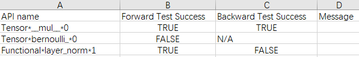
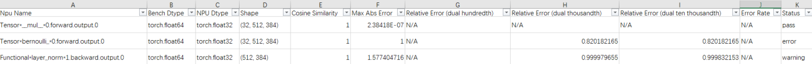

# Ascend模型精度预检工具

Ascend模型精度预检工具能在昇腾NPU上扫描用户训练模型中所有API，输出精度情况的诊断和分析。工具会提取模型中所有的API前反向信息，构造相应的API单元测试，将NPU输出与标杆比对，从而检测出精度有问题的API。

工具支持PyTorch版本：1.8.1/1.11.0/2.0/2.1。

## 工具特性

1. 落盘数据小
2. 不依赖标杆侧GPU训练资源，本地即可完成预检
3. 支持随机生成模式和真实数据模式
4. 单API测试，排除整网中的累计误差问题

## 工具安装

1. 将att仓代码下载到本地，并配置环境变量。假设下载后att仓路径为 $ATT_HOME，环境变量应配置为：

   ```bash
   export PYTHONPATH=$PYTHONPATH:$ATT_HOME/debug/accuracy_tools/
   ```

2. 安装依赖tqdm、rich、pyyaml

   ```bash
   pip3 install tqdm rich pyyaml
   ```

## 使用方式

1. 在训练脚本（如main.py）中加入以下代码导入工具dump模块，启动训练即可自动抓取网络所有API信息

   - 如果训练脚本是通过torch.utils.data.dataloader方式加载数据，就可以在训练脚本中加入以下代码导入工具dump模块，启动训练即可自动抓取网络所有API信息

      ```python
      import api_accuracy_checker.dump
      ```

      工具默认抓取训练的**第二个迭代**并且在第二个迭代后会报错退出训练进程，可通过target_iter参数配置。

      **报错信息如下，这个报错仅用于停止训练，属于正常现象**：

      ```bash
      Exception: Model pretest: exit after iteration 1.
      ```

   - 若报错信息不一致，可能是由于服务器的其他错误信息覆盖导致，可以尝试查找报错信息中的Exception。

   - 若训练脚本中的代码不是通过torch.utils.data.dataloader来加载数据或在部分流水并行、张量并行场景下，工具的开关无法在每张卡上自动打开，导致多卡训练dump结果只有一组json，那么需要在训练代码中添加打开工具开关的调用：

      ```Python
      import api_accuracy_checker.dump as DP
      DP.dump.set_dump_switch("ON")
      
      ...
      
      DP.dump.set_dump_switch("OFF")    # 可选，未配置"OFF"参数时表示dump从DP.dump.set_dump_switch("ON")开始的所有数据
      ```

      DP.dump.set_dump_switch：开启工具dump模块，该接口取值为"ON"和"OFF"，配置OFF时，仅结束dump操作不结束训练进程，用户需要手动结束训练进程。

      上述代码要添加在迭代前向的代码段中，或者说是遍历数据集循环的代码段中。如对于GPT-3可以添加在pretrain_gpt.py 的forward_step函数中。之后工具会适配这个场景开关的自动打开。

   dump信息默认会存盘到“./step1”路径下（相对于启动训练的路径），包括：

   - forward_info_{pid}.json：前向API信息文件。
   - backward_info_{pid}.json：反向API信息文件。
   - stack_info_{pid}.json：调用栈信息文件。

   forward_info与stack_info中的key值一一对应，用户可根据forward_info中API的key在stack_info中查询到其调用栈及代码行位置。

   若有需要，用户可以通过msCheckerConfig.update_config来配置dump路径以及开启真实数据模式、指定dump某个step或配置API dump白名单，详细请参见“**msCheckerConfig.update_config**”。

2. 将API信息输入给run_ut模块运行精度检测并比对，运行如下命令： 

   ```bash
   cd $ATT_HOME/debug/accuracy_tools/api_accuracy_checker/run_ut
   python run_ut.py -forward ./forward_info_0.json -backward ./backward_info_0.json
   ```

   某些场景下（如推理），可以不指定backward_info_0.json，不影响预检功能。

   | 参数名称                         | 说明                                                         | 是否必选 |
   | -------------------------------- | ------------------------------------------------------------ | -------- |
   | -forward或--forward_input_file   | 指定前向API信息文件forward_info_{pid}.json。                 | 是       |
   | -backward或--backward_input_file | 指定反向API信息文件backward_info_{pid}.json。                | 否       |
   | -save_error_data                 | 保存精度未达标的API输入输出数据。                            | 否       |
   | -o或--out_path                   | 指指定run_ut执行结果存盘路径，默认“./”（相对于run_ut的路径）。 | 否       |
   | -j或--jit_compile                | 开启jit编译。                                                | 否       |
   | -d或--device                     | 指定Device ID，选择UT代码运行所在的卡，默认值为0。           | 否       |
   | -csv_path或--result_csv_path     | 指定本次运行中断时生成的`accuracy_checking_result_{timestamp}.csv`文件路径，执行run_ut中断时，若想从中断处继续执行，配置此参数即可。 | 否       |

   run_ut执行结果包括`accuracy_checking_result_{timestamp}.csv`和`accuracy_checking_details_{timestamp}.csv`两个文件。`accuracy_checking_result_{timestamp}.csv`是API粒度的，标明每个API是否通过测试。建议用户先查看`accuracy_checking_result_{timestamp}.csv`文件，对于其中没有通过测试的或者特定感兴趣的API，根据其API name字段在`accuracy_checking_details_{timestamp}.csv`中查询其各个输出的达标情况以及比较指标。详细介绍请参见“**预检结果**”。

3. 如果需要保存比对不达标的输入和输出数据，可以在run_ut执行命令结尾添加-save_error_data，例如：

   ```bash
   python run_ut.py -forward ./forward_info_0.json -backward ./backward_info_0.json -save_error_data
   ```
   数据默认会存盘到'./ut_error_data'路径下（相对于启动run_ut的路径），有需要的话，用户可以通过msCheckerConfig.update_config来配置保存路径，参数为error_data_path。

## msCheckerConfig.update_config

**功能说明**

配置精度预检dump时的属性。

可选配置。

**函数原型**

```python
msCheckerConfig.update_config(dump_path="./", real_data=False, target_iter=[1], white_list=[])
```

**参数说明**

| 参数名称    | 说明                                                         | 是否必选 |
| ----------- | ------------------------------------------------------------ | -------- |
| dump_path   | 设置dump路径，须为已存在目录，默认为当前目录。               | 否       |
| real_data   | 真实数据模式，可取值True或False，默认为False，表示随机数据模式，配置为True后开启真实数据模式，dump信息增加forward_real_data和backward_real_data目录，目录下保存每个API输入的具体数值。 | 否       |
| target_iter | 指定dump某个step的数据，默认为[1]，须指定为训练脚本中存在的step。target_iter为list格式，可配置逐个step，例如：target_iter=[0,1,2]；也可以配置step范围，例如：target_iter=list(range(0,9))，表示dump第0到第8个step。 | 否       |
| white_list  | API dump白名单，指定dump具体API数据，也可以直接配置预检的API白名单，详细请参见“**API预检白名单**”。参数示例：white_list=["conv1d", "conv2d"]。默认未配置白名单，即dump全量API数据。 | 否       |

**函数示例**

- 示例1：配置dump路径以及开启真实数据模式

  ```python
  from api_accuracy_checker.dump import msCheckerConfig
  msCheckerConfig.update_config(dump_path="my/dump/path", real_data=True)
  ```

- 示例2：指定dump某个step

  ```python
  from api_accuracy_checker.dump import msCheckerConfig
  msCheckerConfig.update_config(target_iter=[0,1,2])
  ```

## API预检白名单

精度预检工具可以对指定API进行预检操作，可以使用如下方式：

- 方式一：

  修改att/debug/accuracy_tools/api_accuracy_checker目录下config.yaml文件的white_list参数，配置需要预检的API名称。

- 方式二：

  在dump时的训练脚本中直接添加白名单参数，只dump指定的API数据，示例代码如下：

  ```python
  from api_accuracy_checker.dump import msCheckerConfig
  msCheckerConfig.update_config(white_list=["conv1d", "conv2d"])
  ```

说明：

- 配置的API名称须存在于att\debug\accuracy_tools\api_accuracy_checker\hook_module目录下的support_wrap_ops.yaml文件下。
- 方式一和方式二都可以在dump时设置并控制dump对应的API，默认情况下没有配置白名单，dump所有API数据，若在dump操作时没有配置白名单，那么可以在执行run_ut模块前使用方式一配置白名单。

## 预检结果

精度预检生成的`accuracy_checking_result_{timestamp}.csv`和`accuracy_checking_details_{timestamp}.csv`文件示例如下：

可以通过先查看`accuracy_checking_result_{timestamp}.csv`文件的Forward Test Success和Backward Test Success，判断是否存在未通过测试的API，再查看`accuracy_checking_details_{timestamp}.csv`文件的API详细达标情况，API达标情况介绍请参见“**API预检指标**”。

`accuracy_checking_result_{timestamp}.csv`



| 字段                  | 含义                                                         |
| --------------------- | ------------------------------------------------------------ |
| API name              | API名称。                                                    |
| Forward Test Success  | 前向API是否通过测试，TRUE为通过，FALSE为不通过，N/A表示该行非前向API。 |
| Backward Test Success | 反向API是否通过测试，TRUE为通过，FALSE为不通过，N/A表示该行非反向API。 |
| Message               | 备注信息。                                                   |

`accuracy_checking_details_{timestamp}.csv`



| 字段                                  | 含义                                                         |
| ------------------------------------- | ------------------------------------------------------------ |
| Npu Name                              | NPU下的API名称。                                             |
| Bench Dtype                           | 标杆数据的数据类型。                                         |
| NPU Dtype                             | NPU数据的数据类型。                                          |
| Shape                                 | API的Shape信息。                                             |
| Cosine Similarity                     | 余弦相似度。                                                 |
| Max Abs Error                         | 最大绝对误差。                                               |
| Relative  Error (dual hundredth)      | 双百精度指标。                                               |
| Relative  Error (dual thousandth)     | 双千精度指标。                                               |
| Relative  Error (dual ten thousandth) | 双万精度指标。                                               |
| Error Rate                            | 误差率。                                                     |
| Status                                | 通过状态，pass表示通过测试，error表示未通过，waring表示存在双千或双万精度指标未通过测试。 |

## API预检指标

API预检通过测试，则在`accuracy_checking_details_{timestamp}.csv`文件中的“pass”列标记“pass”，否则标记“error”或“warning”，详细规则如下：

1. 余弦相似度 > 0.99：≤ 0.99为不达标，标记“error”，> 0.99达标，进行下一步；
2. 最大绝对误差 ＜ 0.001：＜ 0.001达标，标记“pass”，≥ 0.001为不达标，进行下一步；
3. 双百、双千、双万精度指标：
   - 对于float16和bfloat16数据：双百指标不通过，标记“error”；双百指标通过，双千指标不通过，标记“warning”；双百、双千指标均通过，标记“pass”。
   - 对于float32和float64数据：双千指标不通过，标记“error”；双千指标通过，双万指标不通过，标记“warning”；双千、双万指标均通过，标记“pass”。

4. 在`accuracy_checking_result_{timestamp}.csv`中以“Forward Test Success”和“Backward Test Success”字段统计该算子前向反向输出的测试结果，对于标记“pass”的算子，则在`accuracy_checking_result_{timestamp}.csv`中标记“TRUE”表示测试通过，对于标记“error”或“warning”的算子，则在`accuracy_checking_result_{timestamp}.csv`中标记“FALSE”表示测试不通过。由于一个算子可能有多个前向或反向的输入或输出，那么该类算子的输入或输出中必须全为“pass”，才能在`accuracy_checking_result_{timestamp}.csv`中标记“TRUE”，只要有一个输入或输出标记“error”或“warning”，那么在`accuracy_checking_result_{timestamp}.csv`中标记“FALSE”。

双百、双千、双万精度指标是指NPU的Tensor中的元素逐个与对应的标杆数据对比，相对误差大于百分之一、千分之一、万分之一的比例占总元素个数的比例小于百分之一、千分之一、万分之一。

# 溢出解析工具

针对训练过程中的溢出检测场景（参见[ptdbg_ascend精度工具功能说明](https://gitee.com/ascend/att/tree/master/debug/accuracy_tools/ptdbg_ascend/doc)中的"溢出检测场景"进行溢出检测dump），对于输入正常但输出存在溢出的API，会在训练执行目录下将溢出的API信息按照前向和反向分类，dump并保存为`forward_info_{pid}.json`，前向过程溢出的API可通过该工具对`forward_info_{pid}.json`进行解析，输出溢出API为正常溢出还是非正常溢出，从而帮助用户快速判断。

工具支持PyTorch版本：1.8.1/1.11.0/2.0/2.1。

若溢出检测场景dump结果生成`forward_info_{pid}.json`文件，则使用本工具进行解析。操作步骤如下：

1. 安装预检工具

   将att仓代码下载到本地，并配置环境变量。假设下载后att仓路径为 $ATT_HOME，环境变量应配置为

   ```bash
   export PYTHONPATH=$PYTHONPATH:$ATT_HOME/debug/accuracy_tools/
   ```

   安装依赖tqdm、rich、pyyaml

   ```bash
   pip3 install tqdm rich pyyaml
   ```

2. 执行溢出API解析操作

   ```bash
   cd $ATT_HOME/debug/accuracy_tools/api_accuracy_checker/run_ut
   python run_overflow_check.py -forward ./forward_info_0.json
   ```

   | 参数名称                       | 说明                                               | 是否必选 |
   | ------------------------------ | -------------------------------------------------- | -------- |
   | -forward或--forward_input_file | 指定前向API信息文件forward_info_{pid}.json。       | 是       |
   | -j或--jit_compile              | 开启jit编译。                                      | 否       |
   | -d或--device                   | 指定Device ID，选择UT代码运行所在的卡，默认值为0。 | 否       |
   
   反向过程溢出的API暂不支持该功能。


具体参数解释请参见“Ascend模型精度预检工具”。

# FAQ 

1. run ut过程中出现报错：ERROR:Got unsupported ScalarType BFloat16

   答：请使用最新版本的工具。

2. Dropout算子，CPU和NPU的随机应该不一样，为什么结果比对是一致的？

   答：这个结果是正常的，工具对该算子有特殊处理，只判定位置为0的位置比例大约和设定p值相当。

3. 为什么浮点型数据bench和npu的dtype不一致？

   答：对于fp16的数据，cpu会上升一个精度fp32去计算，这是和算子那边对齐的精度结论，cpu用更高精度去计算会更接近真实值。

4. Tensor 魔法函数具体对应什么操作？

   答：

   | Tensor魔法函数  | 具体操作         |
   | --------------- | ---------------- |
   | `__add__`       | +                |
   | `__and__`       | &                |
   | `__bool__`      | 返回Tensor布尔值 |
   | `__div__`       | /                |
   | `__eq__`        | ==               |
   | `__ge__`        | >=               |
   | `__gt__`        | >                |
   | `__iadd__`      | +=               |
   | `__iand__`      | &=               |
   | `__idiv__`      | /=               |
   | `__ifloordiv__` | //=              |
   | `__ilshift__`   | <<=              |
   | `__imod__`      | %=               |
   | `__imul__`      | *=               |
   | `__ior__`       | \|=              |
   | `__irshift__`   | >>=              |
   | `__isub__`      | -=               |
   | `__ixor__`      | ^=               |
   | `__lshift__`    | <<               |
   | `__matmul__`    | 矩阵乘法         |
   | `__mod__`       | %                |
   | `__mul__`       | *                |
   | `__nonzero__`   | 同`__bool__`     |
   | `__or__`        | \|               |
   | `__radd__`      | +（反向）        |
   | `__rmul__`      | *（反向）        |
   | `__rshift__`    | >>               |
   | `__sub__`       | -                |
   | `__truediv__`   | 同`__div__`      |
   | `__xor__`       | ^                |

