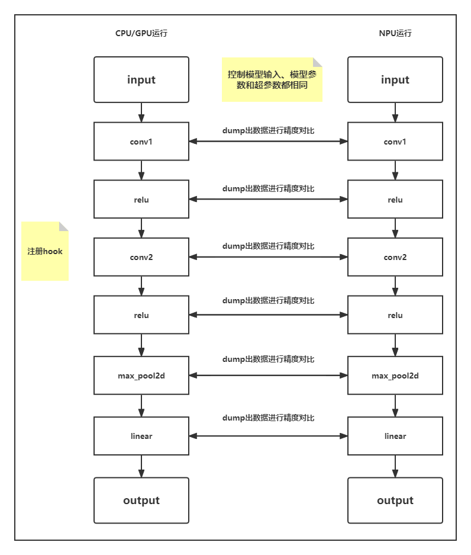

# **PyTorch精度工具**

## 快速安装

进行PyTorch精度比对需要将ptdbg_ascend精度工具分别安装在CPU或GPU环境以及NPU环境下。

1. whl包获取。

   请通过下表链接下载ptdbg_ascend精度工具whl包，推荐下载最新版本。

   | ptdbg_ascend版本 | 发布日期   | 支持PyTorch版本      | 下载链接                                                     | 参考指南                                                     | 校验码                                                       |
   | ---------------- | ---------- | -------------------- | ------------------------------------------------------------ | ------------------------------------------------------------ | ------------------------------------------------------------ |
   | 3.0              | 2023-10-16 | 1.8.1/1.11.0/2.0/2.1 | [ptdbg_ascend-3.0-py3-none-any.whl](https://ptdbg.obs.myhuaweicloud.com/package/ptdbg_ascend/3.0/ptdbg_ascend-3.0-py3-none-any.whl) | [ptdbg_ascend精度工具功能说明_v3.0](doc/ptdbg_ascend精度工具功能说明_v3.0.md) | eb177ec795f8ae8b0c937a3cf543914f535bb64c76ba2e520fc6f0456ff6740b |
   | 2.0              | 2023-7-07  | 1.8.1/1.11.0/2.0     | [ptdbg_ascend-2.0-py3-none-any.whl](https://ptdbg.obs.myhuaweicloud.com/package/ptdbg_ascend/2.0/ptdbg_ascend-2.0-py3-none-any.whl) | [ptdbg_ascend精度工具功能说明_v2.0](doc/ptdbg_ascend精度工具功能说明_v2.0.md) | 85e046f133f0f40ed660337ce8207249b1dac47ac668910625bea49809f31d66 |
   | 1.0              | 2023-3-30  | 1.8.1/1.11.0         | [ptdbg_ascend-1.0-py3-none-any.whl](https://ptdbg.obs.myhuaweicloud.com/package/ptdbg_ascend/1.0/ptdbg_ascend-1.0-py3-none-any.whl) | [ptdbg_ascend精度工具功能说明_v1.0](https://gitee.com/ascend/att/blob/master/debug/accuracy_tools/ptdbg_ascend/doc/ptdbg_ascend%E7%B2%BE%E5%BA%A6%E5%B7%A5%E5%85%B7%E5%8A%9F%E8%83%BD%E8%AF%B4%E6%98%8E_v1.0.md) | 0559e12ba7accf80d182f227698163ee0de88bf86b1e9cd9f33b16fdead14759 |
   
2. whl包校验。

   1. 根据以上下载链接下载whl包到Linux安装环境。

   2. 进入whl包所在目录，执行如下命令。

      ```
      sha256sum {name}.whl
      ```

      {name}为whl包名称。

      若回显呈现对应版本whl包一致的**校验码**，则表示下载了正确的ptdbg_ascend精度工具whl安装包。示例如下：

      ```
      sha256sum ptdbg_ascend-3.1-py3-none-any.whl
      ef0dd5f96faf3576466545f082383eece409f25642a9bc4d0efc944969c1445a  ptdbg_ascend-3.1-py3-none-any.whl
      ```

3. whl包安装。

   执行如下命令进行安装。

   ```bash
   pip3 install ./ptdbg_ascend-{version}-py3-none-any.whl
   ```

   若为覆盖安装，请在命令行末尾增加“--force-reinstall”参数强制安装，例如：

   ```bash
   pip3 install ./ptdbg_ascend-{version}-py3-none-any.whl --force-reinstall
   ```

   提示如下信息则表示安装成功。

   ```bash
   Successfully installed ptdbg_ascend-{version}
   ```

## **PyTorch精度工具简介**

### 概述

在PyTorch训练网络，对同一模型或API调试过程中，遇到API相关的计算精度问题，定位时费时费力。

ptdbg_ascend为PyTorch精度工具，用来进行PyTorch整网API粒度的数据dump、精度比对和溢出检测，从而定位PyTorch训练场景下的精度问题。

**使用场景**

主要的使用场景包括：

- 同一模型，从CPU或GPU移植到NPU中存在精度下降问题，对比NPU芯片中的API计算数值与CPU或GPU芯片中的API计算数值，进行问题定位。
- 同一模型，进行迭代（模型、框架版本升级或设备硬件升级）时存在的精度下降问题，对比相同模型在迭代前后版本的API计算数值，进行问题定位。

### 原理介绍

精度对比工具，通过在PyTorch模型中注册hook，跟踪计算图中API的前向传播与反向传播时的输入与输出，排查存在计算精度误差，进行问题的精准定位。

**精度比对流程**

1. 当模型在CPU或GPU上进行正向和反向传播时，分别dump每一层的数值输入与输出。

2. 当模型在NPU中进行计算时，采用相同的方式dump下相应的数据。

3. 通过对比dump出的数值，计算余弦相似度和最大绝对误差的方式，定位和排查NPU API存在的计算精度问题。如图1所示。

   图1：精度比对逻辑图

   

**API匹配条件**

进行精度比对时，需要判断CPU或GPU的API与NPU的API是否相同可比对，须满足以下匹配条件：

- 两个API的名称相同，API命名规则：`{api_type}_{api_name}_{api调用次数}_{正反向}_{输入输出}.index`，如：Functional_conv2d_1_backward_input.0。
- 两个API的输入输出Tensor数量和各个Tensor的Shape相同。

通常满足以上两个条件，ptdbg_ascend就认为是同一个API，成功进行API的匹配，后续进行相应的计算精度比对。

## **PyTorch精度工具安装**

### 环境准备

- 通过pip安装环境依赖wheel、numpy、pandas（1.3.5及以上版本）和pyyaml。
- ptdbg_ascend与PyTorch有严格的版本配套关系，使用工具前，您需要确保已经正确安装了PyTorch v1.8.1、PyTorch v1.11.0、PyTorch v2.0.0或PyTorch v2.1.0版本：
  - CPU或GPU环境：请至[PyTorch官网](https://www.pytorch.org)下载并安装。
  - NPU环境：请参见《[CANN软件安装指南](https://www.hiascend.com/document/detail/zh/canncommercial/63RC1/envdeployment/instg/instg_000002.html)》“安装开发环境 > 在昇腾设备上安装 > 安装深度学习框架 > 安装PyTorch”章节进行安装。

### 安装

进行PyTorch精度比对需要将ptdbg_ascend精度工具分别安装在CPU或GPU环境以及NPU环境下。

ptdbg_ascend精度工具的安装方式包括：**下载whl包安装**和**源代码编译安装**。

#### 下载whl包安装

1. whl包获取。

   请通过下表链接下载ptdbg_ascend精度工具whl包，推荐下载最新版本。

   | ptdbg_ascend版本 | 发布日期   | 支持PyTorch版本      | 下载链接                                                     | 参考指南                                                     | 校验码                                                       |
   | ---------------- | ---------- | -------------------- | ------------------------------------------------------------ | ------------------------------------------------------------ | ------------------------------------------------------------ |
   | 3.0              | 2023-10-16 | 1.8.1/1.11.0/2.0/2.1 | [ptdbg_ascend-3.0-py3-none-any.whl](https://ptdbg.obs.myhuaweicloud.com/package/ptdbg_ascend/3.0/ptdbg_ascend-3.0-py3-none-any.whl) | [ptdbg_ascend精度工具功能说明_v3.0](doc/ptdbg_ascend精度工具功能说明_v3.0.md) | eb177ec795f8ae8b0c937a3cf543914f535bb64c76ba2e520fc6f0456ff6740b |
   | 2.0              | 2023-7-07  | 1.8.1/1.11.0/2.0     | [ptdbg_ascend-2.0-py3-none-any.whl](https://ptdbg.obs.myhuaweicloud.com/package/ptdbg_ascend/2.0/ptdbg_ascend-2.0-py3-none-any.whl) | [ptdbg_ascend精度工具功能说明_v2.0](doc/ptdbg_ascend精度工具功能说明_v2.0.md) | 85e046f133f0f40ed660337ce8207249b1dac47ac668910625bea49809f31d66 |
   | 1.0              | 2023-3-30  | 1.8.1/1.11.0         | [ptdbg_ascend-1.0-py3-none-any.whl](https://ptdbg.obs.myhuaweicloud.com/package/ptdbg_ascend/1.0/ptdbg_ascend-1.0-py3-none-any.whl) | [ptdbg_ascend精度工具功能说明_v1.0](https://gitee.com/ascend/att/blob/master/debug/accuracy_tools/ptdbg_ascend/doc/ptdbg_ascend精度工具功能说明_v1.0.md) | 0559e12ba7accf80d182f227698163ee0de88bf86b1e9cd9f33b16fdead14759 |
   
2. whl包校验。

   1. 根据以上下载链接下载whl包到Linux安装环境。

   2. 进入whl包所在目录，执行如下命令。

      ```
      sha256sum {name}.whl
      ```

      {name}为whl包名称。

      若回显呈现对应版本whl包一致的**校验码**，则表示下载了正确的ptdbg_ascend精度工具whl安装包。示例如下：

      ```
      sha256sum ptdbg_ascend-3.1-py3-none-any.whl
      ef0dd5f96faf3576466545f082383eece409f25642a9bc4d0efc944969c1445a  ptdbg_ascend-3.1-py3-none-any.whl
      ```

3. whl包安装。

   执行如下命令进行安装。

   ```bash
   pip3 install ./ptdbg_ascend-{version}-py3-none-any.whl
   ```

   若为覆盖安装，请在命令行末尾增加“--force-reinstall”参数强制安装，例如：

   ```bash
   pip3 install ./ptdbg_ascend-{version}-py3-none-any.whl --force-reinstall
   ```

   提示如下信息则表示安装成功。

   ```bash
   Successfully installed ptdbg_ascend-{version}
   ```

#### 源代码编译安装

1. 安装依赖。

   编译前需要安装wheel。

   ```bash
   pip3 install wheel
   ```

2. 下载源码。

   ```bash
   git clone https://gitee.com/ascend/att.git
   ```

3. 配置安装环境。

   ```bash
   cd tools/ptdbg_ascend
   bash ./configure
   ```

   默认情况下，执行上述命会弹出如下交互式会话窗口。

   您的会话可能有所不同，请以实际情况为准。

   ```bash
   Please specify the location of python with available pytorch v1.8.1/v1.11.0 site-packages installed. [Default is /usr/bin/python3]
   (You can make this quiet by set env [ADAPTER_TARGET_PYTHON_PATH]):
   ```

   此时要求输入安装了PyTorch v1.8.1或者v1.11.0 版本的Python解释器路径，若默认路径正确，回车，否则请输入正确的Python解释器路径。

   > 也可以通过设置ADAPTER_TARGET_PYTHON_PATH的环境变量，来抑制交互式窗口弹出，但是要确保路径是有效的，否则仍然弹出。

   配置完成后提示如下信息则表示Python解释器验证成功。

   ```bash
   Configuration finished
   ```

4. 配置cmake。

   ```bash
   mkdir build
   cd build
   cmake ..
   ```

   可能需要几分钟时间下载ptdbg_ascend的依赖项目以完成配置。

5. 执行编译。

   ```bash
   make
   ```

   编译结束后生成如下whl包。

   ```bash
   ./ptdbg_ascend/dist/ptdbg_ascend-{version}-py3-none-any.whl
   ```

6. 安装。

   执行如下命令进行ptdbg_ascend安装。
   
   ```bash
   pip3 install ./ptdbg_ascend/dist/ptdbg_ascend-{version}-py3-none-any.whl --upgrade --force-reinstall
   ```

完成ptdbg_ascend安装后，可以进行PyTorch精度数据的dump和、比对和溢出检测等操作，详细介绍请参见《[PyTorch精度工具使用指南](https://gitee.com/ascend/att/tree/master/debug/accuracy_tools/ptdbg_ascend/doc)》。

## 贡献

push代码前，请务必保证已经完成了基础功能测试和网络测试。

## Release Notes

Release Notes请参见[RELEASE](RELEASE.md).
