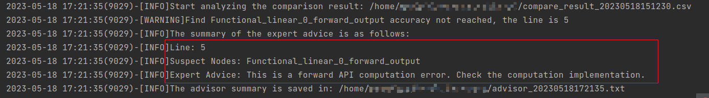

# **PyTorch精度工具使用指南**

本文主要介绍PyTorch精度工具精度工具ptdbg_ascend的使用以及精度比对场景示例。

ptdbg_ascend工具的原理及安装请参见《[PyTorch精度工具](https://gitee.com/ascend/att/blob/master/debug/accuracy_tools/ptdbg_ascend/README.md)》。

## PyTorch精度比对总体流程

1. 准备CPU或GPU训练工程。

2. 在环境下安装ptdbg_ascend工具。

3. 在训练脚本内插入ptdbg_ascend工具dump接口。

4. 执行训练dump数据。

5. 将CPU或GPU训练工程迁移为NPU训练工程。

   请参见《[PyTorch模型迁移和训练指南](https://www.hiascend.com/document/detail/zh/canncommercial/63RC1/modeldevpt/ptmigr/ptmigr_0001.html)》。

6. 在NPU环境下安装ptdbg_ascend工具。

7. 在NPU训练脚本内插入ptdbg_ascend工具dump接口。

8. NPU环境下执行训练dump数据。

9. 创建并配置精度比对脚本，例如compare.py。

10. 执行CPU或GPU dump与NPU dump数据的精度比对。

11. 比对结果分析。

## 场景化示例

本章节主要介绍通过ptdbg_ascend工具进行精度比对和分析，主要使用“**CPU或GPU及NPU精度数据dump**”和“**CPU或GPU与NPU精度数据比对**”章节中介绍的ptdbg_ascend工具接口。

### 单卡场景精度比对

**精度分析建议**

PyTorch训练场景的精度问题分析建议参考以下思路进行精度比对和比对结果分析：

1. 整网比对：dump整网数据并进行精度比对，初步定位异常范围。
2. 缩小范围：根据Accuracy Reached or Not找出不符合精度标准的API。
3. 范围比对：对不符合精度标准的API重新dump。
4. 分析原因并优化：分析API精度不符合标准的原因并进行优化调整。
5. 整网比对：重新进行整网比对，判断优化后的API是否已符合精度标准以及是否出现新的精度问题。
6. 重复1~5步，直到不存在精度问题为止。

**精度分析示例**

1. dump整网数据。

   分别dump CPU或GPU以及NPU数据，在PyTorch训练脚本插入dump接口，示例代码如下（下面以NPU为例，CPU或GPU dump基本相同）：

   ```python
   from ptdbg_ascend import *
   
   # 在main函数开始前固定随机数
   seed_all()
   
   # 配置dump数据目录路径和名称
   set_dump_path("./npu_dump", dump_tag='all')
   
   # 注册dump回调函数
   register_hook(model, acc_cmp_dump)
   
   ...
   
   # 在第一个迭代开始的位置开启dump和堆栈模式，同时为保证数据完整性开启dump bool和整型的tensor以及浮点、bool和整型的标量
   set_dump_switch("ON", mode="api_stack", filter_switch="OFF")
   
   ...
   
   # 在第一个迭代结束的位置关闭dump
   set_dump_switch("OFF")
   ```

2. 比对整网数据。

   第1步中的NPU dump数据文件为npu_dump.pkl，假设NPU dump npy数据目录为npu_dump，GPU dump数据文件为gpu_dump.pkl，GPU dump npy数据目录为gpu_dump。

   创建并配置精度比对脚本，以创建compare.py为例，示例代码如下：

   ```python
   from ptdbg_ascend import *
   dump_result_param={
   "npu_pkl_path": "./npu_dump/all_v2.0/rank0/api_stack_dump.pkl",
   "bench_pkl_path": "./gpu_dump/all_v2.0/rank0/api_stack_dump.pkl",
   "npu_dump_data_dir": "./npu_dump/all_v2.0/rank0/api_stack_dump",
   "bench_dump_data_dir": "./gpu_dump/all_v2.0/rank0/api_stack_dump",
   "is_print_compare_log": True
   }
   compare(dump_result_param, "./output")
   ```

   执行比对：

   ```bash
   python3 compare.py
   ```

   在output目录下生成结果文件，包括：`compare_result_{timestamp}.csv`和`advisor_{timestamp}.txt`

3. 找出存在问题的API。

   1. 根据`advisor_{timestamp}.txt`或打屏信息的提示，可找到存在精度问题的算子（Suspect Nodes）和专家建议（Expert Advice)

      

   2. 根据第2步结果文件`compare_result_{timestamp}.csv`中的Accuracy Reached or No字段显示为NO的API，针对该API执行后续比对操作，分析该API存在的精度问题。

4. （可选）提取指定API的堆栈信息和dump数据统计信息。

   通过parse接口可以清晰的显示特定API的堆栈信息和dump数据统计信息，结合堆栈信息分析代码中可能存在的精度问题。

   创建并配置提取脚本，以创建parse.py为例，示例代码如下：

   ```python
   from ptdbg_ascend import *
   
   # 提取dump信息中第1次调用的API：Torch_batch_normal的堆栈信息及数据统计信息
   parse("./npu_dump/all_v2.0/rank0/api_stack_dump.pkl", "Torch_batch_normal_1_forward")
   ```

   执行提取：

   ```bash
   python3 parse.py
   ```

   

5. （可选）指定API dump数据。

   - dump指定前向API的ACL级别数据

     ```python
     from ptdbg_ascend import *
     
     # 固定随机数，开启确定性计算
     seed_all(mode=True)
     set_dump_path("./dump_path", dump_tag='forward')
     register_hook(model, acc_cmp_dump, dump_mode='acl', dump_config='./dump.json')
     
     # dump指定前向API的ACL级别数据、bool和整型的tensor以及浮点、bool和整型的标量
     set_dump_switch("ON", mode="acl", scope=["Tensor_permute_1_forward"], filter_switch="OFF")
     
     ...
     
     set_dump_switch("OFF")
     ```

   - dump指定反向API的ACL级别数据

     ```python
     from ptdbg_ascend import *
     
     # 固定随机数，开启确定性计算
     seed_all(mode=True)
     set_dump_path("./dump_path", dump_tag='backward')
     register_hook(model, acc_cmp_dump, dump_mode='acl', dump_config='./dump.json')
     
     # dump指定反向API的ACL级别数据、bool和整型的tensor以及浮点、bool和整型的标量
     set_dump_switch("ON", mode="acl", scope=["Functional_conv2d_1_backward"], filter_switch="OFF")
     set_backward_input(["./npu_dump/all_v2.0/rank0/api_stack_dump/Functional_conv2d_1_backward_input.0.npy"])
     
     ...
     
     set_dump_switch("OFF")
     ```

6. （可选）重新比对。

   根据第4或5步的dump数据重新配置compare.py并执行比对，可以对单API模型进行问题复现。

**注意事项**

* dump_mode="acl"场景下，会增加npu的内存消耗，请谨慎开启。
* 部分API存在调用嵌套关系，比如functional.batch_norm实际调用torch.batch_norm，该场景会影响acl init初始化多次，导致功能异常。

### 多卡场景精度比对

精度工具支持多卡场景的精度比对，多卡场景的dump步骤与单卡场景完全一致，请参见“**单卡场景精度比对**”章节，不同的是多卡数据精度比对时需要使用“compare_distributed”函数进行比对。如下示例：

说明：多机多卡场景需要每个设备单独执行比对操作。

假设NPU dump npy数据目录为npu_dump/dump_conv2d_v1.0，GPU dump npy数据目录为gpu_dump/dump_conv2d_v1.0。

1. 创建比对脚本，例如compare_distributed.py，拷贝如下代码。

   ```python
   from ptdbg_ascend import *
   compare_distributed('./npu_dump/ptdbg_dump_v2.0', './gpu_dump/ptdbg_dump_v2.0', './output')
   ```

2. 执行比对：

   ```bash
   python3 compare_distributed.py
   ```

两次运行须用相同数量的卡，传入`compare_distributed`的两个文件夹下须有相同个数的rank文件夹，且不包含其他无关文件，否则将无法比对。

**多卡set_dump_path注意事项**

多卡一般为多进程，须保证每个进程都正确调用set_dump_path，或把set_dump_path插入到import语句后，如：

```python
from ptdbg_ascend import *
seed_all()
set_dump_path('./dump_resnet')
```

如此可保证set_dump_path在每个进程都被调用。

**多卡register_hook注意事项**

register_hook需要在set_dump_path之后调用，也需要在每个进程上被调用，建议在搬运模型数据到卡之后调用。识别方法如下：

- 找到训练代码中遍历epoch的for循环或遍历数据集的for循环，把register_hook放到循环开始前即可。
- 找到训练代码中调用DDP或者DistributedDataParallel的代码行，把register_hook放到该代码行所在的代码块之后。
- 若代码中均无以上两种情况，需要保证register_hook在模型定义之后插入，并配置rank参数。rank参数获取rank_id请参见“**[rank_id获取方法](https://gitee.com/ascend/att/blob/master/debug/accuracy_tools/ptdbg_ascend/doc/rank_id获取方法.md)**”。

### NPU vs NPU精度比对

对于NPU vs NPU场景，是针对同一模型，进行迭代（模型、API版本升级或设备硬件升级）时存在的精度下降问题，对比相同模型在迭代前后版本的API计算数值，进行问题定位。

一般情况下迭代涉及NPU自定义算子，因此，可以仅dump NPU自定义算子进行比对。比对精度问题分析请参见“**单卡场景精度比对**”章节。

工具当前支持dump NPU自定义算子如下：

| 序号 | NPU自定义算子                       |
| :--- | ----------------------------------- |
| 1    | torch_npu.one_                      |
| 2    | torch_npu.npu_sort_v2               |
| 3    | torch_npu.npu_transpose             |
| 4    | torch_npu.npu_broadcast             |
| 5    | torch_npu.npu_dtype_cast            |
| 6    | torch_npu.empty_with_format         |
| 7    | torch_npu.npu_one_hot               |
| 8    | torch_npu.npu_stride_add            |
| 9    | torch_npu.npu_ps_roi_pooling        |
| 10   | torch_npu.npu_roi_align             |
| 11   | torch_npu.npu_nms_v4                |
| 12   | torch_npu.npu_iou                   |
| 13   | torch_npu.npu_nms_with_mask         |
| 14   | torch_npu.npu_pad                   |
| 15   | torch_npu.npu_bounding_box_encode   |
| 16   | torch_npu.npu_bounding_box_decode   |
| 17   | torch_npu.npu_batch_nms             |
| 18   | torch_npu.npu_slice                 |
| 19   | torch_npu._npu_dropout              |
| 20   | torch_npu.npu_indexing              |
| 21   | torch_npu.npu_ifmr                  |
| 22   | torch_npu.npu_max                   |
| 23   | torch_npu.npu_scatter               |
| 24   | torch_npu.npu_layer_norm_eval       |
| 25   | torch_npu.npu_alloc_float_status    |
| 26   | torch_npu.npu_get_float_status      |
| 27   | torch_npu.npu_clear_float_status    |
| 28   | torch_npu.npu_confusion_transpose   |
| 29   | torch_npu.npu_bmmV2                 |
| 30   | torch_npu.fast_gelu                 |
| 31   | torch_npu.npu_sub_sample            |
| 32   | torch_npu.npu_deformable_conv2d     |
| 33   | torch_npu.npu_mish                  |
| 34   | torch_npu.npu_anchor_response_flags |
| 35   | torch_npu.npu_yolo_boxes_encode     |
| 36   | torch_npu.npu_grid_assign_positive  |
| 37   | torch_npu.npu_normalize_batch       |
| 38   | torch_npu.npu_masked_fill_range     |
| 39   | torch_npu.npu_linear                |
| 40   | torch_npu.npu_bert_apply_adam       |
| 41   | torch_npu.npu_giou                  |
| 42   | torch_npu.npu_ciou                  |
| 43   | torch_npu.npu_diou                  |
| 44   | torch_npu.npu_sign_bits_pack        |
| 45   | torch_npu.npu_sign_bits_unpack      |
| 46   | torch_npu.npu_flash_attention       |
| 47   | torch_npu.npu_scaled_masked_softmax |
| 48   | torch_npu.npu_rotary_mul            |
| 49   | torch_npu.npu_roi_align             |
| 50   | torch_npu.npu_roi_alignbk           |
| 51   | torch_npu.npu_ptiou                 |
| 52   | torch_npu.npu_fusion_attention      |

### 通信API的数据dump

通信类API数据可以使用全量dump方式获取，若只dump通信类API数据，可以使用如下示例：

```python
debugger.configure_hook(mode="api_list", api_list=["distributed"])
```

或

```python
set_dump_switch("ON", mode="api_list", api_list=["distributed"])
```

通信类API支持列表：

| 序号 | Distributed          |
| :--- | -------------------- |
| 1    | send                 |
| 2    | recv                 |
| 3    | broadcast            |
| 4    | all_reduce           |
| 5    | reduce               |
| 6    | all_gather           |
| 7    | gather               |
| 8    | isend                |
| 9    | irecv                |
| 10   | scatter              |
| 11   | reduce_scatter       |
| 12   | _reduce_scatter_base |
| 13   | _all_gather_base     |

### 溢出检测场景

溢出检测是针对NPU的PyTorch API，检测是否存在溢出的情况。当前仅支持识别aicore浮点溢出。

溢出检测原理：针对溢出阶段，开启acl dump模式，重新对溢出阶段执行，落盘数据。

建议按照如下步骤操作：

1. 在NPU环境下安装ptdbg_ascend工具。

2. 在NPU训练脚本内插入ptdbg_ascend工具溢出检测接口。

   - 示例1：全量溢出检测

     ```python
     from ptdbg_ascend import *
     seed_all()
     # 配置溢出数据目录路径和名称
     set_dump_path("./overflow_dump")
     ...
     # 设置检测到3次溢出后退出训练
     register_hook(model, overflow_check, overflow_nums=3)
     
     ...
     ```

     多卡使用时各卡单独计算溢出次数。

   - 示例2：dump指定API的ACL级别溢出数据

     ```python
     from ptdbg_ascend import *
     seed_all()
     # 配置溢出数据目录路径和名称
     set_dump_path("./overflow_dump")
     ...
     # dump指定API的ACL级别溢出数据
     register_hook(model, overflow_check, dump_mode='acl', dump_config='./dump.json')
     
     # 在期望溢出检测的step位置开始前打开溢出检测开关
     set_overflow_check_switch("ON")
     
     ...
     
     # 在step结束的位置关闭溢出检测开关
     set_overflow_check_switch("OFF")
     
     ...
     ```

   - 示例3：dump指定反向API的ACL级别的溢出数据

     1. 进行全量溢出检测

        ```python
        from ptdbg_ascend import *
        seed_all()
        # 配置溢出数据目录路径和名称
        set_dump_path("./overflow_dump")
        ...
        # 设置检测到3次溢出后退出训练
        register_hook(model, overflow_check)
        
        ...
        ```

     2. dump指定反向API的ACL级别的溢出数据
     
        ```python
        from ptdbg_ascend import *
        seed_all()
        # 配置溢出数据目录路径和名称
        set_dump_path("./overflow_dump")
        ...
        # dump指定反向API的ACL级别溢出数据
        register_hook(model, acc_cmp_dump, dump_mode='acl', dump_config='./dump.json')
        set_dump_switch("ON", mode="acl", scope=["Functional_conv2d_1_backward"])
        set_backward_input(["./npu_dump/ptdbg_dump_v2.0/rank0/dump/Functional_conv2d_1_backward_input.0.npy"])
        ```

   针对前向溢出API，可以通过overflow_nums，配置允许的溢出次数，并将每次溢出API的全部ACL数据dump下来，到达指定溢出次数后停止，停止后会看到堆栈打印包含如下字段。

   ```bash
   ValueError: [overflow xxx times]: dump file is saved in 'xxxxx.pkl'.
   ```

   其中xxx times为用户设置的次数，xxxxx.pkl为文件生成路径。

3. NPU环境下执行训练dump溢出数据。

   针对输入正常但输出存在溢出的API，会训练执行目录下将溢出的API信息dump并保存为`forward_info_{pid}.json`和`backward_info_{pid}.json`，通过 [Ascend模型精度预检工具](https://gitee.com/ascend/att/tree/master/debug/accuracy_tools/api_accuracy_checker)对json文件进行解析，输出溢出API为正常溢出还是非正常溢出，从而帮助用户快速判断。

   精度预检工具执行命令如下：

   ```bash
   # 下载att代码仓后执行如下命令
   export PYTHONPATH=$PYTHONPATH:$ATT_HOME/debug/accuracy_tools/
   cd $ATT_HOME/debug/accuracy_tools/api_accuracy_checker/run_ut
   python run_overflow_check.py -forward ./forward_info_0.json
   ```
   
   反向过程溢出的API暂不支持精度预检功能。
   
   当重复执行溢出检测dump操作时，需要删除上一次dump目录下的溢出检测dump数据，否则将因重名而报错。

**注意事项**

* dump_mode="acl"场景下，会增加npu的内存消耗，请谨慎开启。
* 部分API存在调用嵌套关系，比如functional.batch_norm实际调用torch.batch_norm，该场景会影响acl init初始化多次，导致功能异常。
* 混合精度动态loss scale场景下，正常训练会有"Gradient overflow. SKipping step"日志，添加溢出检测后日志消失，可以通过设置环境变量export OVERFLOW_DEBUG_MODE_ENABLE=1，并将register_hook位置调整amp.initialize之前解决。此功能需要cann包配套支持，不支持版本执行报错EZ3003。

## debugger方式dump和溢出检测（推荐）

### PrecisionDebugger模块

**功能说明**

PrecisionDebugger模块包含dump和溢出检测功能的总体配置项。可以指定dump目录，设置dump或溢出检测功能，指定dump的卡和迭代。

可以在from ptdbg_ascend import *和模型初始化之间的任意位置添加该模块。

**原型**

```python
PrecisionDebugger(dump_path=None, hook_name=None, rank=None, step=[], enable_dataloader=False):
```

**参数说明**

| 参数名            | 说明                                                         | 是否必选 |
| ----------------- | ------------------------------------------------------------ | -------- |
| dump_path         | 设置dump数据目录路径，参数示例："./dump_path"。<br/>默认在dump_path目录下生成`ptdbg_dump_{version}`目录，并在该目录下生成`dump.pkl`文件以及`dump`数据文件保存目录。<br/>当**configure_hook**函数配置了mode参数时，`dump.pkl`文件以及`dump`数据文件保存目录名称添加mode参数值为前缀，详情请参见“**dump数据存盘说明**”。<br/>未配置dump_path时，也可以通过环境变量ASCEND_WORK_PATH配置dump路径，此时dump数据将落盘在${ASCEND_WORK_PATH}/dump_data下，自定义配置dump_path优先级高于环境变量，dump_path和环境变量需要二选一。 | 否       |
| hook_name         | dump模式，可取值dump和overflow_check，表示dump和溢出检测功能，二选一。 | 是       |
| rank              | 指定对某张卡上的数据进行dump或溢出检测，默认未配置（表示dump所有卡的数据），须根据实际卡的Rank ID配置。应配置为大于0的正整数，且须根据实际卡的Rank ID配置，若所配置的值大于实际训练所运行的卡的Rank ID，则dump数据为空，比如当前环境Rank ID为0~7，实际训练运行0~3卡，此时若配置Rank ID为4或不存在的10等其他值，此时dump数据为空。 | 否       |
| step              | 指定dump某个step的数据，默认未配置，须指定为训练脚本中存在的step。step为list格式，可配置逐个step，例如：step=[0,1,2]；也可以配置step范围，例如：step=list(range(0,9))，表示dump第0到第8个step。 | 否       |
| enable_dataloader | 自动控制开关，可取值True（开启）或False（关闭），默认为False。配置为True后自动识别dump step参数指定的迭代，并在该迭代执行完成后退出训练，此时start和stop函数可不配置，开启该开关要求训练脚本是通过torch.utils.data.dataloader方式加载数据；配置为False则需要配置start和stop函数，并在最后一个stop函数后或一个step结束的位置添加debugger.step()。 | 否       |

### configure_hook函数（可选）

**功能说明**

设置dump范围。

建议在**PrecisionDebugger**模块与模型初始化之间的任意位置添加，不添加此函数时默认使用mode="api_stack" dump整网数据。

**原型**

dump：

```python
debugger.configure_hook(mode="api_stack", scope=[], api_list=[], filter_switch="OFF", acl_config=None, backward_input=[], input_output_mode=["all"], summary_only=False)
```

溢出检测：

```python
debugger.configure_hook(mode=None, acl_config=None, overflow_nums=1, need_replicate=False)
```

**参数说明**

| 参数名            | 说明                                                         | 是否必选 |
| ----------------- | ------------------------------------------------------------ | -------- |
| mode              | dump模式。可取值"all"、"list"、"range"、"stack"、"acl"、"api_list"、"api_stack"，各参数含义请参见本节的“**函数示例**”。参数示例：mode="list"。默认为api_stack。该参数配置值将作为dump数据文件名的前缀，详情请参见“**dump数据存盘说明**”。 | 否       |
| scope或api_list   | dump范围。根据model配置的模式选择dump的API范围，mode="api_list"时，需要配置api_list=[]，其他模式有需要时配置scope=[]。参数示例：scope=["Tensor_permute_1_forward", "Tensor_transpose_2_forward"]、api_list=["relu"]。默认为空。 | 否       |
| filter_switch     | dump bool和整型的tensor以及浮点、bool和整型的标量的过滤开关。可取值"ON"（表示开启过滤，即不dump）或"OFF"（表示关闭过滤）。参数示例：filter_switch="ON"。默认不配置，即filter_switch="OFF"，表示dump上述数据。 | 否       |
| acl_config        | acl dump的配置文件。mode="acl"时，该参数必选；mode为其他值时，该参数不选。参数示例：acl_config='./dump.json'。dump.json配置文件详细介绍请参见“**dump.json配置文件说明**”。 | 否       |
| backward_input    | 该输入文件为首次运行训练dump得到反向API输入的.npy文件。例如若需要dump Functional_conv2d_1 API的反向过程的输入输出，则需要在dump目录下查找命名包含Functional_conv2d_1、backward和input字段的.npy文件。 | 否       |
| input_output_mode | dump数据过滤。可取值"all"、"forward"、"backward"、"input"和"output"，表示仅保存dump的数据中文件名包含"forward"、"backward"、"input"和"output"的前向、反向、输入或输出的.npy文件。参数示例input_output_mode=["backward"]或input_output_mode=["forward", "backward"]。默认为all，即保存所有dump的数据。除了all参数只能单独配置外，其他参数可以自由组合。 | 否       |
| summary_only      | dump npy文件过滤，可取值True或False，配置为True后仅dump保存API统计信息的pkl文件，参数示例：summary_only=False，默认为False。 | 否       |
| overflow_nums     | 控制溢出次数，表示第N次溢出时，停止训练，过程中检测到溢出API对应ACL数据均dump。参数示例：overflow_nums=3。配置overflow_check时可配置，默认不配置，即检测到1次溢出，训练停止，配置为-1时，表示持续检测溢出直到训练结束。 | 否       |
| need_replicate    | 过程dump数据生成开关，执行溢出检测时，dump目录下会生成forward_real_data和backward_real_data的过程dump数据目录，可取值True（生成）或False（不生成），默认不生成。 | 否       |

**函数示例**

configure_hook可配置多种dump模式，示例如下：

说明：以下均以dump部分API数据为例，API名可以从首次dump整网数据的结果csv文件中的NPU Name或Bench Name列获取。

- 示例1：dump指定API列表

  ```python
  debugger.configure_hook(mode="list", scope=["Tensor_permute_1_forward", "Tensor_transpose_2_forward", "Torch_relu_3_backward"])
  ```

- 示例2：dump指定范围

  ```python
  debugger.configure_hook(mode="range", scope=["Tensor_abs_1_forward", "Tensor_transpose_3_forward"])
  ```

- 示例3：STACK模式，只dump堆栈信息

  ```python
  debugger.configure_hook(mode="stack", scope=["Tensor_abs_1_forward", "Tensor_transpose_3_forward"])
  ```

- 示例4：dump指定前向API的ACL级别数据

  ```python
  debugger.configure_hook(mode="acl", scope=["Tensor_permute_1_forward"], acl_config="./dump.json")
  ```

- 示例4：dump指定反向API的ACL级别数据

  ```python
  debugger.configure_hook(mode="acl", scope=["Functional_conv2d_1_backward"], acl_config="./dump.json", backward_input=["./npu_dump/dump_conv2d_v2.0/rank0/dump/Functional_conv2d_1_backward_input.0.npy"])
  ```

- 示例5：dump指定某一类API的API级别输入输出数据

  ```python
  debugger.configure_hook(mode="api_list", api_list=["relu"])
  ```

  mode="api_list"时不配置scope。

- 示例6：dump全部API级别输入输出数据以及相应堆栈信息

  ```python
  debugger.configure_hook(mode="api_stack")
  ```

  mode="api_stack"时不配置scope。

- 示例7： dump全部API级别输入输出数据并包含bool和整型的tensor以及浮点、bool和整型的标量，配置为OFF，会dump bool和整型数据

  ```python
  debugger.configure_hook(filter_switch="OFF")
  ```

  配置filter_switch="OFF"同时也可以配置mode、scope和api_list，除dump ACL级别数据。

- 示例8：仅保存dump的数据文件名包含“backward”的反向.npy文件

  ```python
  debugger.configure_hook(input_output_mode=["backward"])
  ```

- 示例9：仅dump pkl文件

  ```python
  debugger.configure_hook(summary_only=True)
  ```

- 示例10：溢出检测dump

  ```python
  debugger.configure_hook(overflow_nums=1)
  ```

  dump执行时会在**PrecisionDebugger**模块的dump_path参数指定的目录下生成ptdbg_dump_{version}目录，保存溢出数据。

  多卡场景时，需要检测到至少有一张卡溢出次数达到overflow_nums时，训练结束。

  仅支持NPU环境。

- 示例11：dump溢出API的ACL级别数据

  ```python
  debugger.configure_hook(mode="acl", acl_config="./dump.json")
  ```

  该场景会在原有数据基础上，额外在dump.json文件配置的dump_path目录下生成一份ACL算子数据，该数据可通过“**ptdbg_ascend.parse**”工具进行解析。

  仅支持NPU环境。

### start函数（可选）

**功能说明**

dump或溢出检测启动函数。

在模型初始化之后的任意位置添加。

**原型**

```python
debugger.start()
```

该函数为类函数，可以使用debugger.start()也可以使用PrecisionDebugger.start()。

### stop函数（可选）

**功能说明**

dump或溢出检测停止函数。

在**start**函数之后的任意位置添加。

**原型**

```python
debugger.stop()
```

该函数为类函数，可以使用debugger.stop()也可以使用PrecisionDebugger.stop()。

### 示例代码（自动模式）

- 示例1：开启dump

  ```python
  from ptdbg_ascend import *
  debugger = PrecisionDebugger(dump_path="./dump_path", hook_name="dump", step=[0,2], enable_dataloader=True)
  # 请勿将以上初始化流程插入到循环代码中
  ```
  
- 示例2：开启溢出检测dump

  ```python
  from ptdbg_ascend import *
  debugger = PrecisionDebugger(dump_path="./dump_path", hook_name="overflow_check", step=[0,2], enable_dataloader=True)
  # 请勿将以上初始化流程插入到循环代码中
  ```

### 示例代码（手动模式）

一般情况下使用自动模式可以快速方便进行dump操作，但个别大模型可能在部分卡的训练操作中没有调用dataloader，这会导致自动模式无法dump指定迭代的数据，此时需要关闭自动模式手动在迭代前后插入start()和stop()函数，并在最后一个stop函数后或一个step结束的位置添加debugger.step()以标识dump结束。

- 示例1：开启dump

  ```python
  from ptdbg_ascend import *
  debugger = PrecisionDebugger(dump_path="./dump_path", hook_name="dump", step=[0])
  # 请勿将以上初始化流程插入到循环代码中
  
  # 模型初始化
  # 下面代码也可以用PrecisionDebugger.start()和PrecisionDebugger.stop()
  debugger.start()
  
  # 需要dump的代码片段1
  
  debugger.stop()
  debugger.start()
  
  # 需要dump的代码片段1
  
  debugger.stop()
  debugger.step()
  ```

- 示例2：开启溢出检测dump

  ```python
  from ptdbg_ascend import *
  debugger = PrecisionDebugger(dump_path="./dump_path", hook_name="overflow_check", step=[0])
  # 请勿将以上初始化流程插入到循环代码中
  
  # 模型初始化
  # 下面代码也可以用PrecisionDebugger.start()和PrecisionDebugger.stop()
  debugger.start()
  
  # 需要dump的代码片段1
  
  debugger.stop()
  debugger.start()
  
  # 需要dump的代码片段1
  
  debugger.stop()
  debugger.step()
  ```

## CPU或GPU及NPU精度数据dump 

### 总体说明

- 本节主要介绍CPU或GPU及NPU精度数据dump所需要的函数以及示例。

- ptdbg_ascend工具默认情况下仅dump PyTorch模型的API输入输出数据进行精度比对，若在比对结果中发现某个API下可能存在ACL的精度问题，那么可以选择dump该API的ACL级别数据进行精度分析。

- 某些torch api的输出不是Tensor类型的数据。对于此类API的反向过程进行ACL dump，工具会在运行日志中给出对应的Warning（is not of tensor type and cannot be automatically derived）提示。如若想要进行该类API反向ACL dump，可以通过手动构建单API用例的方式进行ACL dump，具体用例可参见“**[反向ACL dump用例说明](https://gitee.com/ascend/att/blob/master/debug/accuracy_tools/ptdbg_ascend/doc/%E5%8F%8D%E5%90%91ACL%20dump%E7%94%A8%E4%BE%8B%E8%AF%B4%E6%98%8E.md)**”。

- 工具性能：dump数据量较小时（小于5G），参考dump速度0.1GB/s；dump数据量较大时，参考dump速度0.2GB/s。
  推荐环境配置：独占环境，CPU核心数192，固态硬盘（IO速度参考：固态硬盘 > 500MB/s，机械硬盘60 ~ 170MB/s）。
  
  用户环境性能弱于标准约束或非独占使用的比对速度酌情向下浮动。Dump速度的计算方式：Dump数据量/(单个step添加Dump耗时-原始单个step耗时）。

### 约束
- 进行CPU或GPU数据dump时，请安装torch包而非torch_npu包，避免工具无法识别使用场景，导致失败。
  
- TASK_QUEUE_ENABLE环境变量会导致API下发和执行异步进行，因此在ACL dump前需要将TASK_QUEUE_ENABLE关闭，即export TASK_QUEUE_ENABLE=0。

- 不建议在PyTorch训练脚本中同时添加dump接口和性能数据采集（如Ascend PyThon Profiler）接口，二者可能相互影响导致数据不准确。

### seed_all

**功能说明**

固定随机数。通过固定随机数保证模型的输入或输出一致。在训练主函数开始前调用，避免随机数固定不全。

dump操作必选。

**函数原型**

```python
seed_all(seed=1234, mode=False)
```

**参数说明**

| 参数名 | 说明                                                         | 是否必选 |
| ------ | ------------------------------------------------------------ | -------- |
| seed   | 随机数种子。参数示例：seed=1000。默认值为：1234。            | 否       |
| mode   | 确定性计算模式。可配置True或False。参数示例：mode=True。默认为False。<br/>即使在相同的硬件和输入下，API多次执行的结果也可能不同，开启确定性计算是为了保证在相同的硬件和输入下，API多次执行的结果相同。<br/>确定性计算会导致API执行性能降低，建议在发现模型多次执行结果不同的情况下开启。<br/>rnn类算子、ReduceSum、ReduceMean等算子可能与确定性计算存在冲突，若开启确定性计算后多次执行的结果不相同，则考虑存在这些算子。 | 否       |

**函数示例**

seed_all函数的随机数种子，取默认值即可，无须配置；第二个参数默认关闭，不开启确定性计算时也无须配置。

- 示例1：仅固定随机数，不开启确定性计算

  ```python
  seed_all()
  ```

- 示例2：固定随机数，开启确定性计算

  ```python
  seed_all(mode=True)
  ```

**固定随机数范围**

seed_all函数可固定随机数的范围如下表。

| API                                      | 固定随机数                  |
| ---------------------------------------- | --------------------------- |
| os.environ['PYTHONHASHSEED'] = str(seed) | 禁止Python中的hash随机化    |
| random.seed(seed)                        | 设置random随机生成器的种子  |
| np.random.seed(seed)                     | 设置numpy中随机生成器的种子 |
| torch.manual_seed(seed)                  | 设置当前CPU的随机种子       |
| torch.cuda.manual_seed(seed)             | 设置当前GPU的随机种子       |
| torch.cuda.manual_seed_all(seed)         | 设置所有GPU的随机种子       |
| torch_npu.npu.manual_seed(seed)          | 设置当前NPU的随机种子       |
| torch_npu.npu.manual_seed_all(seed)      | 设置所有NPU的随机种子       |
| torch.backends.cudnn.enable=False        | 关闭cuDNN                   |
| torch.backends.cudnn.benchmark=False     | cuDNN确定性地选择算法       |
| torch.backends.cudnn.deterministic=True  | cuDNN仅使用确定性的卷积算法 |

需要保证CPU或GPU以及NPU的模型输入完全一致，dump数据的比对才有意义，seed_all并不能保证模型输入完全一致，如下表所示场景需要保证输入的一致性。

| 场景            | 固定方法      |
| --------------- | ------------- |
| 数据集的shuffle | 关闭shuffle。 |
| dropout         | 关闭dropout。 |

关闭shuffle示例：

```python
train_loader = torch.utils.data.DataLoader(
	train_dataset,
	batch_size = batch_size,
	shuffle = False,
	num_workers = num_workers
)
```

关闭dropout：

在使用from ptdbg import *后，工具会自动将torch.nn.functional.dropout、torch.nn.functional.dropout2d、torch.nn.functional.dropout3d、torch.nn.Dropout、torch.nn.Dropout2d、torch.nn.Dropout3d的接口参数p置为0。

### set_dump_path

**功能说明**

设置数据保存目录。建议在seed_all函数之后调用且需要保证训练进程能够调用该函数；多卡时须保证每个进程都能调用该函数。

**函数原型**

```python
set_dump_path(fpath=None, dump_tag='ptdbg_dump')
```

**参数说明**

| 参数名   | 说明                                                         | 是否必选 |
| -------- | ------------------------------------------------------------ | -------- |
| fpath    | 设置数据目录路径。参数示例：'./dump_path'。<br/>默认在dump_path目录下生成`ptdbg_dump_{version}`目录，并在该目录下生成`dump.pkl`文件以及`dump`数据文件保存目录。<br/>当set_dump_switch函数配置了mode参数时，`dump.pkl`文件以及`dump`数据文件保存目录名称添加mode参数值为前缀，详情请参见“**dump数据存盘说明**”。<br/>未配置fpath时，也可以通过环境变量ASCEND_WORK_PATH配置dump路径，此时数据将落盘在${ASCEND_WORK_PATH}/dump_data下，自定义配置dump_path优先级高于环境变量，fpath和环境变量需要二选一。 | 否       |
| dump_tag | 设置数据目录名称。参数示例：dump_tag='dump_conv2d'。默认数据目录命名为ptdbg_dump_{version}。<br/>{version}为当前安装ptdbg_ascend工具版本。目录结构参见“**dump数据存盘说明**”。<br/>配置该参数会将生成的`ptdbg_dump_{version}`目录名称变更为dump_tag配置的值，如`dump_conv2d_{version}`。 | 否       |

**函数示例**

- 示例1：设置数据目录路径

  ```python
  set_dump_path('./dump_path')
  ```

- 示例2：设置数据目录名称

  ```python
  set_dump_path('./dump_path', dump_tag='dump_conv2d')
  ```


若以相同的数据目录多次dump，则会因同名导致覆盖；多次dump建议配置不同的dump_tag。

### register_hook

**功能说明**

注册工具钩子函数。在set_dump_path之后调用。

dump操作必选。

**函数原型**

```python
register_hook(model, hook, overflow_nums=overflow_nums, dump_mode=dump_mode, dump_config=dump_config_file)
```

**参数说明**

| 参数名        | 说明                                                         | 是否必选 |
| ------------- | ------------------------------------------------------------ | -------- |
| hook          | 注册工具的dump和溢出检测钩子。可取值overflow_check（表示溢出检测）和acc_cmp_dump（表示dump数据），二选一。 | 是       |
| overflow_nums | 控制溢出次数，表示第N次溢出时，停止训练，过程中检测到溢出API对应ACL数据均dump。参数示例：overflow_nums=3。配置overflow_check时可配置，默认不配置，即检测到1次溢出，训练停止，配置为-1时，表示持续检测溢出直到训练结束。 | 否       |
| dump_mode     | 控制针对溢出API的dump模式。可取值"api"或"acl"，配置acl时表示dump ACL级别的溢出数据，此时set_dump_path参数不生效，dump数据目录由dump_config的.json文件配置，参数示例：dump_mode="acl"。默认不配置，即dump API级别的溢出数据。 | 否       |
| dump_config   | acl dump的配置文件。dump_mode="acl"时，该参数必选；dump_mode="api"时，该参数不选。参数示例：dump_config='./dump.json'。 | 否       |

**函数示例**

- 示例1：注册工具钩子函数

  ```python
  register_hook(model, acc_cmp_dump)
  ```

- 示例2：dump指定API的ACL级别数据

  ```python
  register_hook(model, acc_cmp_dump, dump_mode='acl', dump_config='./dump.json')
  ```

  需要配置set_dump_switch的mode="acl"以及scope指定为前向或反向API，请参见“**set_dump_switch”**的示例。

  该场景set_dump_path不生效，由dump_config中的dump.json文件配置dump数据目录。

- 示例3：溢出检测dump

  ```python
  register_hook(model, overflow_check, overflow_nums=3)
  ```

  dump执行时会在set_dump_path的fpath参数指定的目录下生成ptdbg_dump_{version}目录，保存溢出数据。

  多卡场景时，需要检测到至少有一张卡溢出次数达到overflow_nums时，训练结束。

  仅支持NPU环境。

- 示例4：dump指定API的ACL级别溢出数据

  ```python
  register_hook(model, overflow_check, dump_mode='acl', dump_config='./dump.json')
  ```

  该场景会在原有数据基础上，额外在dump.json文件配置的dump_path目录下生成一份ACL算子数据，该数据可通过“**ptdbg_ascend.parse**”工具进行解析。

  仅支持NPU环境。

### set_dump_switch

**功能说明**

设置dump范围。建议在register_hook函数之后的脚本内任意位置插入，但进行精度问题排查建议参照“场景化示例 > 单卡场景精度比对”章节的顺序，先从第一个迭代开始的位置调用并dump整网数据。

dump操作必选。

**函数原型**

```python
def set_dump_switch(switch, mode="all", scope=[], api_list=[], filter_switch="OFF", dump_mode=["all"], summary_only=False):
```

**参数说明**

| 参数名          | 说明                                                         | 是否必选 |
| --------------- | ------------------------------------------------------------ | -------- |
| switch          | dump开关。可取值"ON"或"OFF"。须在选定dump开始的位置配置set_dump_switch("ON")；dump结束的位置设置set_dump_switch("OFF")。 | 是       |
| mode            | dump模式。可取值"all"、"list"、"range"、"stack"、"acl"、"api_list"、"api_stack"，各参数含义请参见本节的“**函数示例**”。参数示例：mode="list"。默认为all。该参数配置值将作为dump数据文件名的前缀，详情请参见“**dump数据存盘说明**”。 | 否       |
| scope或api_list | dump范围。根据model配置的模式选择dump的API范围。参数示例：scope=["Tensor_permute_1_forward", "Tensor_transpose_2_forward"]、api_list=["relu"]。默认为空。 | 否       |
| filter_switch   | dump bool和整型的tensor以及浮点、bool和整型的标量的过滤开关。可取值"ON"或"OFF"。参数示例：filter_switch="ON"。默认不配置，即filter_switch="OFF"，表示dump上述数据。 | 否       |
| dump_mode       | dump数据过滤。可取值"all"、"forward"、"backward"、"input"和"output"，表示仅保存dump的数据中文件名包含"forward"、"backward"、"input"和"output"的前向、反向、输入或输出的.npy文件。参数示例dump_mode=["backward"]或dump_mode=["forward", "backward"]。默认为all，即保存所有dump的数据。除了all参数只能单独配置外，其他参数可以自由组合。 | 否       |
| summary_only    | dump npy文件过滤，可取值True或False，配置为True后仅dump保存API统计信息的pkl文件，参数示例：summary_only=False，默认为False。 | 否       |

**推荐配置**

```python
set_dump_switch("ON", mode="api_stack", filter_switch="OFF")
```

开启dump数据和堆栈模式，同时为保证数据完整性开启dump bool和整型的tensor以及浮点、bool和整型的标量。

**函数示例**

set_dump_switch可配置多种dump模式，示例如下：

说明：以下均以dump部分API数据为例，API名可以从首次dump整网数据的结果csv文件中的NPU Name或Bench Name列获取。

- 示例1：dump指定API列表

  ```python
  set_dump_switch("ON", mode="list", scope=["Tensor_permute_1_forward", "Tensor_transpose_2_forward", "Torch_relu_3_backward"])
  ```

- 示例2：dump指定范围

  ```python
  set_dump_switch("ON", mode="range", scope=["Tensor_abs_1_forward", "Tensor_transpose_3_forward"])
  ```

- 示例3：STACK模式，只dump堆栈信息

  ```python
  set_dump_switch("ON", mode="stack", scope=["Tensor_abs_1_forward", "Tensor_transpose_3_forward"])
  ```

- 示例4：dump指定前向API的ACL级别数据

  ```python
  register_hook(model, acc_cmp_dump, dump_mode='acl', dump_config='./dump.json')
  set_dump_switch("ON", mode="acl", scope=["Tensor_permute_1_forward"])
  ```

  需要配置register_hook的dump_mode='acl'和dump_config配置文件。

- 示例4：dump指定反向API的ACL级别数据

  ```python
  register_hook(model, acc_cmp_dump, dump_mode='acl', dump_config='./dump.json')
  set_dump_switch("ON", mode="acl", scope=["Functional_conv2d_1_backward"])
  set_backward_input(["./npu_dump/dump_conv2d_v2.0/rank0/dump/Functional_conv2d_1_backward_input.0.npy"])
  ```

  需要配置register_hook的dump_mode='acl'和dump_config配置文件，并通过set_backward_input设置反向API输入的.npy文件。

- 示例5：dump指定某一类API的API级别输入输出数据

  ```python
  set_dump_switch("ON", mode="api_list", api_list=["relu"])
  ```

  mode="api_list"时不配置scope。

- 示例6：dump全部API级别输入输出数据以及相应堆栈信息

  ```python
  set_dump_switch("ON", mode="api_stack")
  ```

  mode="api_stack"时不配置scope。

- 示例7： dump全部API级别输入输出数据并包含bool和整型的tensor以及浮点、bool和整型的标量，配置为OFF，会dump bool和整型数据

  ```python
  set_dump_switch("ON", filter_switch="OFF")
  ```

  配置filter_switch="OFF"同时也可以配置mode、scope和api_list，除dump ACL级别数据。
  
- 示例8：仅保存dump的数据文件名包含“backward”的反向.npy文件

  ```python
  set_dump_switch("ON", dump_mode=["backward"])
  ```
  
- 示例9：仅dump pkl文件

  ```python
  set_dump_switch("ON", summary_only=True)
  ```

以上示例均需要在结束dump的位置插入set_dump_switch("OFF")。

set_dump_switch配置mode为all或api_stack时，结束dump后，在dump目录下会自动生成compare_data.py比对脚本模板，示例如下：

```python
from ptdbg_ascend import compare

pkl_path = "%s"
dump_data_dir = "%s"

dump_path_param = {
	"npu_pkl_path": ,
	"bench_pkl_path": ,
	"npu_dump_data_dir": ,
	"bench_dump_data_dir": ,
	"is_print_compare_log": True
}

compare(dump_path_param, output_path="", stack_mode="%s")
```

pkl_path和dump_data_dir字段会自动识别pkl和dump目录的路径，用户需要判断当前dump的环境是NPU、CPU或GPU，并将pkl_path和dump_data_dir字段填入下方dump_path_param函数对应的字段中，例如当前设备为NPU，那么填写方式如下：

```python
from ptdbg_ascend import compare

pkl_path = "%s"
dump_data_dir = "%s"

dump_path_param = {
    "npu_pkl_path": pkl_path,
	"bench_pkl_path": ,
	"npu_dump_data_dir": dump_data_dir,
	"bench_dump_data_dir": ,
	"is_print_compare_log": True
}

compare(dump_path_param, output_path="", stack_mode="%s")
```

此时，另一侧数据的路径，需要用户另外识别并填入。

### set_overflow_check_switch

**功能说明**

置溢出检测范围。默认不配置该函数，全量进行溢出检测。

仅支持NPU环境。

**函数原型**

```python
set_overflow_check_switch(switch, filter_switch='OFF')
```

**参数说明**

| 参数名        | 说明                                                         | 是否必选 |
| ------------- | ------------------------------------------------------------ | -------- |
| switch,       | 检测开关。可取值"ON"或"OFF"。如果只在特定的step溢出检测，则在期望溢出检测的step位置开始前插入set_overflow_check_switch("ON")，在step结束的位置插入set_overflow_check_switch("OFF")。 | 是       |
| filter_switch | dump bool和整型的tensor以及浮点、bool和整型的标量的过滤开关。可取值"ON"或"OFF"。参数示例：filter_switch="ON"。默认不配置，即filter_switch="OFF"，表示dump上述数据。 | 否       |

**函数示例**

- 示例1：指定范围溢出检测

  ```python
  register_hook(model, overflow_check)
  set_overflow_check_switch("ON")
  
  ...
  
  set_overflow_check_switch("OFF")
  ```

  该场景set_dump_path不生效，dump执行时会在当前目录自动生成ptdbg_dump_{version}目录，保存溢出数据。

- 示例2：前向API的ACL级别范围溢出检测

  ```python
  register_hook(model, overflow_check, dump_mode='acl', dump_config='./dump.json')
  set_overflow_check_switch("ON")
  
  ...
  
  set_overflow_check_switch("OFF")
  ```

  该场景set_dump_path不生效，由dump_config中的dump.json文件配置溢出数据目录。

### set_backward_input 

**功能说明**

设置反向ACL级别dump时需要的反向输入的.npy文件。

**函数原型**

```python
set_backward_input(backward_input)
```

**参数说明**

| 参数名         | 说明                                                         | 是否必选 |
| -------------- | ------------------------------------------------------------ | -------- |
| backward_input | 该输入文件为首次运行训练dump得到反向API输入的.npy文件。例如若需要dump Functional_conv2d_1 API的反向过程的输入输出，则需要在dump目录下查找命名包含Functional_conv2d_1、backward和input字段的.npy文件。 | 是       |

**函数示例**

```python
register_hook(model, acc_cmp_dump, dump_mode='acl', dump_config='./dump.json')
set_dump_switch("ON", mode="acl", scope=["Functional_conv2d_1_backward"])
set_backward_input(["./npu_dump/dump_conv2d_v2.0/rank0/dump/Functional_conv2d_1_backward_input.0.npy"])
```

## dump.json配置文件说明

**dump.json配置示例**

```python
{
 "dump":
 {
         "dump_list":[],
         "dump_path":"./dump/output",
         "dump_mode":"all",
         "dump_op_switch":"on"
 }
}
```

**dump.json参数说明**

| 字段名         | 说明                                                         |
| -------------- | ------------------------------------------------------------ |
| dump_list      | 待dump数据的API模型。为空，无需配置。                        |
| dump_path      | dump数据文件存储到运行环境的目录，主要用于指定ACL dump数据路径。支持配置绝对路径或相对路径。dump_path须为已存在目录。 |
| dump_mode      | dump数据模式，配置如下：<br/>- output：dump API的输出数据。默认值。<br/>- input：dump API的输入数据。<br/>-  all：dump API的输入、输出数据。 |
| dump_op_switch | 单API模型dump数据开关，配置如下： * off：关闭单API模型dump，默认值。 * on：开启单API模型dump。 |

**dump目录说明**

配置register_hook的dump_config后，采集的dump数据会在{dump_path}/{time}/{deviceid}/{model_id}目录下生成，例如“/home/HwHiAiUser/output/20200808163566/0/0”

```bash
├── 20230131172437
│   └── 1
│       ├── 0
│       │   ├── Add.Add.45.0.1675157077183551
│       │   ├── Cast.trans_Cast_0.31.0.1675157077159449
│       │   ├── Cast.trans_Cast_5.43.0.1675157077180129
│       │   ├── MatMul.MatMul.39.0.1675157077172961
│       │   ├── Mul.Mul.29.0.1675157077155731
│       │   ├── NPUAllocFloatStatus.NPUAllocFloatStatus.24.0.1675157077145262
│       │   ├── TransData.trans_TransData_1.33.0.1675157077162791
│       │   └── TransData.trans_TransData_4.41.0.1675157077176648
│       ├── 1701737061
│       │   └── Cast.trans_Cast_2.35.0.1675157077166214
│       ├── 25
│       │   └── NPUClearFloatStatus.NPUClearFloatStatus.26.0.1675157077150342
│       └── 68
│           └── TransData.trans_TransData_3.37.0.1675157077169473
```

## 模块级精度数据dump 

### 总体说明

大模型场景下，通常不是简单的利用自动迁移能力实现GPU到NPU的训练脚本迁移，而是会对NPU网络进行一系列针对性的适配，因此，常常会造成迁移后的NPU模型存在部分子结构不能与GPU原始模型完全对应。模型结构不一致导致API调用类型及数量不一致，若直接按照API粒度进行精度数据dump和比对，则无法完全比对所有的API。

本节介绍的功能是对模型中的大粒度模块进行数据dump，使其比对时，对于无法以API粒度比对的模块可以直接以模块粒度进行比对。

模块指的是继承自nn.Module类模块，通常情况下这类模块就是一个小模型，可以被视为一个整体，dump数据时以模块为粒度进行dump。

### module_dump

**功能说明**

开启模块级精度数据dump。

模块级精度数据dump时必选。

**函数原型**

```python
module_dump(module, module_name)
```

**参数说明**

| 参数名      | 说明                                                         | 是否必选 |
| ----------- | ------------------------------------------------------------ | -------- |
| module      | 网络中实例化好的nn.Module类模块的model对象。                 | 是       |
| module_name | 用户自定义的该model名称。主要用于dump数据文件的命名，便于在比对时识别模块级数据。 | 是       |

### module_dump_end

**功能说明**

结束模块级精度数据dump。

模块级精度数据dump时必选。

**函数原型**

```python
module_dump_end()
```

### 示例代码

```python
# 根据需要import包
import os
import torch
import torch.nn as nn
import torch_npu
from ptdbg_ascend import *

torch.npu.set_device("npu:0")
# 定义一个简单的网络
class ModuleOP(nn.Module):
    def __init__(self) -> None:
        super().__init__()
        self.linear_1 = nnLinear(in_features=2, out_features=2)
        self.linear_2 = nnLinear(in_features=2, out_features=1)
        self.relu = nn.Relu()
    def forward(self, x):
        x1 = self.linear_1(x)
        x1 = self.linear_2(x1)
        r1 = self.relu(x2)
        return r1
    
if __name__ == "__main__":
    module = ModuleOP
    
    # 注册工具
    set_dump_path("./dump_data/npu")
    set_dump_switch("ON")
    register_hook(module, acc_cmp_dump)
    
    x = torch.randn(2, 2)
    
    module_dump(module, "MyModule")    # 开启模块级精度数据dump
    out = module(x)
    module_dump_end()    # 结束模块级精度数据dump
    loss = out.sum()
    loss.bachward()
    set_dump_switch("OFF")
```

## dump数据存盘说明

dump结果目录结构示例如下：

```bash
├── dump_path
│   └── ptdbg_dump_{version}
│       ├── rank0
│       │   ├── dump
|       |   |    ├── Tensor_permute_1_forward.npy
|       |   |    ├── MyModule_0_forward_input.npy    # 开启模块级精度数据dump时存在模块级的dump数据文件
|       |   |    ...
|       |   |    └── Fcuntion_linear_5_backward_output.npy
│       │   └── dump.pkl
│       ├── rank1
|       |   ├── dump
|       |   |   └── ...
|       |   └── dump.pkl 
│       ├── ...
│       |
|       └── rank7
```

其中ptdbg_dump_{version}为未设置set_dump_path的dump_tag参数时的默认命名；rank为设备上各卡的ID，每张卡上dump的数据会生成对应dump目录。

当使用debugger方式dump数据时，配置了PrecisionDebugger模块的step=[]参数，dump结果目录则以step为父目录，例如配置step=[0,1,2]时，dump结果目录为：

```
├── dump_path
│   └── step0
│   |  └── ptdbg_dump_{version}
│   |  |   ├── rank0
│   |  |   ├── ...
│   |  |   ├── rank7
|   ├── step1
|   |  |   ├── ...
│   └── step2
```

**精度比对dump场景**

精度比对dump场景的结果如下：

* dump.pkl文件：包含dump数据的API名称、dtype、 shape以及各数据的max、min、mean统计信息。

* dump目录：目录下为npy格式的dump数据。

   npy文件保存的前缀和PyTorch对应关系如下

   | 前缀       | Torch模块           |
   | ---------- | ------------------- |
   | Tensor     | torch.Tensor        |
   | Torch      | torch               |
   | Functional | torch.nn.functional |
   | NPU        | NPU亲和算子         |
   | VF         | torch._VF           |

当set_dump_switch或configure_hook配置mode参数（例如：mode="api_stack" ）时，dump结果的文件名会添加api_stack前缀，dump结果如下：

* api_stack_dump.pkl
* api_stack_dump目录

**溢出检测dump场景**

register_hook设置了overflow_check时，检测API溢出，dump结果的文件名格式为：`{api_type}___{api_name}___{API调用次数}_{前向反向}_{当前溢出次数}`，dump结果示例如下：

* `Tensor___add___1_forward_1.pkl`
* `Tensor___add___1_forward_1`目录

## CPU或GPU与NPU精度数据比对

### 总体说明

- 本节主要介绍CPU或GPU与NPU精度数据比对的函数以及示例。

- 比对函数均通过单独创建精度比对脚本执行，可支持单卡和多卡场景的精度数据比对。

- 工具性能：比对数据量较小时（参考值单份文件小于10GB），参考比对速度0.1GB/s；比对数据量较大时，参考比对速度0.3GB/s。
  推荐环境配置：独占环境，CPU核心数192，固态硬盘（IO速度参考：固态硬盘 > 500MB/s，机械硬盘60 ~ 170MB/s）。
  
  用户环境性能弱于标准约束或非独占使用的比对速度酌情向下浮动。比对速度的计算方式：两份比对文件大小/比对耗时。

### 约束

- NPU自研API，在CPU或GPU若没有对应的API，该API的dump数据不比对。
  
- NPU与CPU或GPU的计算结果误差可能会随着模型的执行不断累积，最终会出现同一个API因为输入的数据差异较大而无法比对的情况。

- CPU或GPU与NPU中两个相同的API会因为调用次数不同导致无法比对或比对到错误的API，不影响整体运行，该API忽略。

### compare_distributed

**功能说明**

将CPU或GPU与NPU的dump文件进行比对，支持单卡和多卡，可同时比对多卡的dump数据。多机场景需要每个设备单独执行比对操作。可自动检索和匹配对应卡和进程所dump的数据文件，再调用compare进行比对。单机单卡时与compare函数二选一。

**函数原型**

```python
compare_distributed(npu_dump_dir, bench_dump_dir, output_path, **kwargs)
```

**参数说明**

| 参数名         | 说明                                                         | 是否必选 |
| -------------- | ------------------------------------------------------------ | -------- |
| npu_dump_dir   | 配置NPU环境下的dump目录，即set_dump_path函数的dump_tag参数对应的目录名称。参数示例：'./npu_dump/dump_conv2d_v2.0'。 | 是       |
| bench_dump_dir | 配置CPU、GPU或NPU环境下的dump目录，即set_dump_path函数的dump_tag参数对应的目录名称。参数示例：'./gpu_dump/dump_conv2d_v2.0'。 | 是       |
| output_path    | 配置比对结果csv文件存盘目录。需要预先创建output_path目录。参数示例：'./output'。文件名称基于时间戳自动生成，格式为：`compare_result_rank{npu_ID}-rank{cpu/gpu/npu_ID}_{timestamp}.csv`。 | 是       |
| **kwargs       | 支持compare的所有可选参数。                                  | 否       |

**函数示例**

创建比对脚本，例如compare_distributed.py，拷贝如下代码，具体参数请根据实际环境修改。

```python
from ptdbg_ascend import *
compare_distributed('./npu_dump/ptdbg_dump_v2.0', './gpu_dump/ptdbg_dump_v2.0', './output')
```

### compare

**功能说明**

将CPU或GPU与NPU的dump文件进行比对，仅支持单机单卡。

**函数原型**

```python
compare(input_param, output_path, stack_mode=False, auto_analyze=True, fuzzy_match=False)
```

**参数说明**

| 参数名       | 说明                                                         | 是否必选 |
| ------------ | ------------------------------------------------------------ | -------- |
| input_param  | 配置dump数据文件及目录。配置参数包括：<br/>- "npu_pkl_path"：指定NPU dump目录下的.pkl文件。参数示例："npu_pkl_path": "./npu_dump/ptdbg_dump_v2.0/rank0/api_stack_dump.pkl"。必选。<br/>- "bench_pkl_path"：指定CPU、GPU或NPU dump目录下的.pkl文件。参数示例："bench_pkl_path": "./gpu_dump/ptdbg_dump_v2.0/rank0/api_stack_dump.pkl"。必选。<br/>- "npu_dump_data_dir"："指定NPU dump目录下的dump数据目录。参数示例："npu_dump_data_dir": "./npu_dump/ptdbg_dump_v2.0/rank0/api_stack_dump"。必选。<br/>- "bench_dump_data_dir"："指定CPU、GPU或NPU dump目录下的dump数据目录。参数示例："npu_dump_data_dir": "./gpu_dump/ptdbg_dump_v2.0/rank0/api_stack_dump"。必选。<br/>- "is_print_compare_log"：配置是否开启日志打屏。可取值True或False。可选。 | 是       |
| output_path  | 配置比对结果csv文件存盘目录。参数示例：'./output'。文件名称基于时间戳自动生成，格式为：`compare_result_{timestamp}.csv`。 | 是       |
| stack_mode   | 配置stack_mode的开关。仅当dump数据时配置set_dump_switch的mode="api_stack"时需要开启。参数示例：stack_mode=True，默认为False。 | 否       |
| auto_analyze | 自动精度分析，开启后工具自动针对比对结果进行分析，识别到第一个精度不达标节点（在比对结果文件中的“Accuracy Reached or Not”列显示为No），并给出问题可能产生的原因（打屏展示并生成advisor_{timestamp}.txt文件）。可取值True或False，参数示例：auto_analyze=False，默认为True。 | 否       |
| fuzzy_match  | 模糊匹配。开启后，对于网络中同一层级且命名仅调用次数不同的API，可匹配并进行比对。可取值True或False，参数示例：fuzzy_match=True，默认为False。 | 否       |

**函数示例**

单机单卡场景下创建比对脚本，例如compare.py，拷贝如下代码，具体参数请根据实际环境修改。

```python
from ptdbg_ascend import *
dump_result_param={
"npu_pkl_path": "./npu_dump/ptdbg_dump_v2.0/rank0/api_stack_dump.pkl",
"bench_pkl_path": "./gpu_dump/ptdbg_dump_v2.0/rank0/api_stack_dump.pkl",
"npu_dump_data_dir": "./npu_dump/ptdbg_dump_v2.0/rank0/api_stack_dump",
"bench_dump_data_dir": "./gpu_dump/ptdbg_dump_v2.0/rank0/api_stack_dump",
"is_print_compare_log": True
}
compare(dump_result_param, "./output", stack_mode=True)
```

### parse

**功能说明**

解析并提取dump信息中的堆栈信息及数据统计信息。

**函数原型**

```python
parse(pkl_file, moudule_name_prefix)
```

**参数说明**

| 参数名              | 说明                                                         | 是否必选 |
| ------------------- | ------------------------------------------------------------ | -------- |
| pkl_file            | 指定dump数据文件中的pkl文件名。参数示例："./npu_dump/ptdbg_dump_v2.0/rank0/dump.pkl"。 | 是       |
| moudule_name_prefix | 指定待提取的API接口前缀。参数示例："Torch_norm_1_forward"。  | 是       |

**函数示例**

创建堆栈信息及数据统计信息提取脚本，例如parse.py，拷贝如下代码，具体参数请根据实际环境修改。

```python
from ptdbg_ascend import *
parse("./npu_dump/ptdbg_dump_v2.0/rank0/dump.pkl", "Torch_batch_normal_1_forward")
```

### 计算精度评价指标

PyTorch精度比对是以CPU或GPU的计算结果为标杆，计算Cosine（余弦相似度）、MaxAbsErr（最大绝对误差）和MaxRelativeErr（最大相对误差），根据这两个结果判断API在运行时是否存在精度问题。

计算精度评价指标：

1. Cosine：通过计算两个向量的余弦值来判断其相似度，数值越接近于1说明计算出的两个张量越相似，实际可接受阈值为大于0.99。在计算中可能会存在nan，主要由于可能会出现其中一个向量为0。

2. MaxAbsErr：当最大绝对误差越接近0表示其计算的误差越小，实际可接受阈值为小于0.001。

3. MaxRelativeErr：当最大相对误差越接近0表示其计算的误差越小。

   当dump数据中存在0或Nan时，比对结果中最大相对误差则出现inf或Nan的情况，属于正常现象。

精度比对结果csv文件中只需要通过Accuracy Reached or Not来判断计算精度是否达标，判断标准如下：

1. Cosine < 0.99 且 MaxAbsError > 0.001时，精度不达标，标记为“No”。
2. Cosine < 0.9，精度不达标，标记为“No”。
3. MaxAbsError > 1，精度不达标，标记为“No”。
4. 其余情况下记为精度达标，标记为“Yes”。

## ptdbg_ascend.parse数据解析功能

ptdbg_ascend.parse为命令行交互式界面解析工具，提供更多的数据解析功能并且展示结果。

主要的使用场景包括：

- 支持指定ACL层级算子数据比对。
- 支持指定ACL层级算子数据转换及展示。
- 支持交互式指定pkl文件中API对应dump数据查看。
- 支持API进行可选层级比对和打印（统计级和像素级）。

安装ptdbg_ascend工具后，可以通过使用命令 **python -m ptdbg_ascend.parse** 进入交互式界面，可在parse的界面中执行Shell命令，以及上述场景的相关解析命令。Ctrl+C可以退出该界面。

### ACL层级算子数据比对

- 依赖：CANN包中的msaccucmp工具。

- 输入以下比对命令进行数据比对。

  ```bash
  vc -m my_dump_path -g golden_dump_path [-out output_path]
  ```
  
  | 参数名称 | 说明                                                         | 是否必选 |
  | -------- | ------------------------------------------------------------ | -------- |
  | -m       | 待比对dump数据目录。                                         | 是       |
  | -g       | dump数据目录。                                               | 是       |
  | -out     | 结果输出目录。                                               | 否       |
  | -asc     | 指定msaccucmp路径，默认路径为：/usr/local/Ascend/ascend-toolkit/latest/tools/operator_cmp/compare/msaccucmp.py。 | 否       |
  
  - 输出结果：result_{timestamp}.csv文件。
  - 若指定-out参数需要用户传入输出路径，并且路径需要已存在。
  - 若未指定输出目录， 则比对结束后将结果保存在默认目录 “./parse_data/comapre_result”中，比对结束后会打印log提示输出结果存放路径。

**示例**

```bash
# 传入待比对数据目录以及标杆数据目录
Parse >>> vc -m ./my_dump_path -g ./golden_data_path 
......
# 比对结果打印
[INFO] The comparison result have been written to "./parse_data/compare_result/result_20230818104735.csv".
[INFO] The command was completed and took 6 seconds.
[INFO] Compare finished!!
```

### ACL算子数据的npy转换

- 依赖：CANN包中的msaccucmp工具。

- 输入以下转换命令进行数据转换， 将ACL级别dump数据转为npy文件。

  ```bash
  dc -n file_name/file_path [-f format] [-out output_path]
  ```

  | 参数名称 | 说明                                                         | 是否必选 |
  | -------- | ------------------------------------------------------------ | -------- |
  | -n       | 需转换的dump数据文件或dump数据文件目录。                     | 是       |
  | -f       | 开启format转换，指定该参数时需要配置format格式，若未指定该参数，则直接转换为npy格式。 | 否       |
  | -out     | 结果输出目录。                                               | 否       |
  | -asc     | 指定msaccucmp路径，默认路径为：/usr/local/Ascend/ascend-toolkit/latest/tools/operator_cmp/compare/msaccucmp.py | 否       |

  [^]: 若传入单个dump文件，则转换单个文件，若传入dump文件目录则转换目录下所有dump文件。

  - 输出结果：npy文件。
  - 若指定-out参数需要用户传入输出路径，并且路径需要已存在。
  - 若未指定输出目录， 则比对结束后将结果保存在默认目录 “./parse_data/convert_result”中，比对结束后会打印log提示输出结果存放路径及转换结果。

- 输入以下命令，展示npy数据统计信息。

  ```bash
  pt -n file_path
  ```

  | 参数名称 | 说明          | 是否必选 |
  | -------- | ------------- | -------- |
  | -n       | npy文件路径。 | 是       |

  打印统计信息：shape, dtype, max, min和mean。

**示例1**

```bash
# 传入需转换的dump文件目录
Parse >>> dc -n ./dump_data/
......
# 转换结果
╭──────────────────────────────────────────────────────────────────────────────────────────────────────╮
│ SrcFile: ./dump_data/
│  - Add.fp32_vars_add_2fp32_vars_Relu_9.31.5.1636595794731103.input.0.npy                             │
│  - Add.fp32_vars_add_1fp32_vars_Relu_6.24.5.1636595794631347.output.0.npy                            │
│  - Add.fp32_vars_add_2fp32_vars_Relu_9.31.5.1636595794731103.input.1.npy                             │
│  - Add.fp32_vars_add_1fp32_vars_Relu_6.24.5.1636595794631347.input.1.npy                             │
│  - Add.fp32_vars_add_3fp32_vars_Relu_12.40.5.1636595794846124.input.1.npy                            │
│  - Add.fp32_vars_add_1fp32_vars_Relu_6.24.5.1636595794631347.input.0.npy                             │
│  - Add.fp32_vars_add_3fp32_vars_Relu_12.40.5.1636595794846124.input.0.npy                            │
│  - Add.fp32_vars_add_2fp32_vars_Relu_9.31.5.1636595794731103.output.0.npy                            │
│  - Add.fp32_vars_add_3fp32_vars_Relu_12.40.5.1636595794846124.output.0.npy                           │
╰──────────────────────────────────────────────────────────────────────────────────────────────────────╯
```

**示例2**

```bash
# 查看某个dump数据块的数据信息
# 默认会将数据中的tensor保存成 txt
Parse >>> pt -n ./parse_data/dump_convert/Add.fp32_vars_add_1fp32_vars_Relu_6.24.5.1636595794631347.output.0.npy
......
# 打印统计信息
[Shape: (1, 16, 56, 56, 16)] [Dtype: float16] [Max: 452.0] [Min: -408.5] [Mean: -3.809]
Path: ./parse_data/dump_convert/Add.fp32_vars_add_1fp32_vars_Relu_6.24.5.1636595794631347.input.0.npy                           
TextFile:./parse_data/dump_convert/Add.fp32_vars_add_1fp32_vars_Relu_6.24.5.1636595794631347.input.0.npy.txt 
```

### pkl文件中指定API的dump数据信息查看

- 输入以下命令，解析并输出pkl文件中指定api的统计信息。

  ```bash
  pk -f pkl_path -n api_name
  ```

  | 参数名称 | 说明              | 是否必选 |
  | -------- | ----------------- | -------- |
  | -f       | 指定pkl文件路径。 | 是       |
  | -n       | 指定API名称。     | 是       |

  - 输出结果：打印统计信息（shape, dtype, max和min mean）。
  - 若pkl文件中存在相应的堆栈信息，则会打印堆栈信息。

**示例**

```bash
# 传入pkl文件及api名称
Parse >>> pk -f ./torch_dump/ptdbg_v3.2/rank0/api_stack_dump.pkl -n Functional_conv2d_0_forward
......
# 打印统计信息及堆栈（pkl文件不包含堆栈则不会打印堆栈）

Statistic Info:
  [Functional_conv2d_0_forward_input.0][dtype: torch.float32][shape: [2, 1, 2, 2]][max: 1.576936960220337][min: -0.9757485389709473][mean: 0.4961632490158081]
  [Functional_conv2d_0_forward_input.1][dtype: torch.float32][shape: [2, 1, 2, 2]][max: 0.20064473152160645][min: -0.47102075815200806][mean: -0.20796933770179749]
  [Functional_conv2d_0_forward_input.2][dtype: torch.float32][shape: [2]][max: 0.17380613088607788][min: -0.16853803396224976][mean: 0.0026340484619140625]
  [Functional_conv2d_0_forward_output][dtype: torch.float32][shape: [2, 2, 1, 1]][max: 0.02364911139011383][min: -1.762906551361084][mean: -0.6710853576660156]
```

### API可选层级比对

- 输入以下命令, 进行统计级和像素级比对。

  ```bash
  cn -m my_data*.npy -g gloden*.npy [-p num] [-al atol] [-rl rtol]
  ```

  - 统计级比对：对tensor整体进行余弦值及相对误差的计算。
  - 像素级比对：对输入的两个npy文件进行逐元素比对。若两个tensor对应元素的相对误差或绝对误差大于**误差阈值**（-al和-rl配置）则被标记为错误数据。

  | 参数名称 | 说明                                            | 是否必选 |
  | -------- | ----------------------------------------------- | -------- |
  | -m       | 待比对数据。                                    | 是       |
  | -g       | 标杆数据。                                      | 是       |
  | -p       | 设置比对结束后打印错误元素的个数，默认值20。    | 否       |
  | -al      | 判定数据存在精度问题的绝对误差阈值，默认0.001。 | 否       |
  | -rl      | 判定数据存在精度问题的相对误差阈值，默认0.001。 | 否       |
  | -s       | 将npy文件保存成txt文件，用于查看，默认开启。    | 否       |
  
  输出结果：
  
  - 统计级比对结果。
  - 两个文件的统计信息（shape, dtype, max, min和mean）。
  - 错误数据打印表格。

**示例**

```bash
# 对比两个tensor的数据
Parse >>> cn -m Add.InceptionV3_InceptionV3_Mixed_7a_Branch_0_add_3.323.1619494134703053.output.0.npy -g InceptionV3_InceptionV3_Mixed_7a_Branch_0_add_3.0.1619492699305998.npy -p 10 -s -al 0.002 -rl 0.005
                  Error Item Table                                        Top Item Table
┏━━━━━━━┳━━━━━━━━━━━━━━━┳━━━━━━━━━━━━━━┳━━━━━━━━━━━━━━┓ ┏━━━━━━━┳━━━━━━━━━━━━━┳━━━━━━━━━━━━━┳━━━━━━━━━━━━━━━┓
┃ Index ┃ Left          ┃ Right        ┃ Diff         ┃ ┃ Index ┃ Left        ┃ Right       ┃ Diff          ┃
┡━━━━━━━╇━━━━━━━━━━━━━━━╇━━━━━━━━━━━━━━╇━━━━━━━━━━━━━━┩ ┡━━━━━━━╇━━━━━━━━━━━━━╇━━━━━━━━━━━━━╇━━━━━━━━━━━━━━━┩
│ 155   │ 0.024600908   │ 0.022271132  │ 0.002329776  │ │ 0     │ -0.9206961  │ -0.9222216  │ 0.0015255213  │
│ 247   │ 0.015752593   │ 0.017937578  │ 0.0021849852 │ │ 1     │ -0.6416973  │ -0.64051837 │ 0.0011789203  │
│ 282   │ -0.0101207765 │ -0.007852031 │ 0.0022687456 │ │ 2     │ -0.35383835 │ -0.35433492 │ 0.0004965663  │
│ 292   │ 0.019581757   │ 0.02240482   │ 0.0028230622 │ │ 3     │ -0.18851271 │ -0.18883198 │ 0.00031927228 │
│ 640   │ -0.06593232   │ -0.06874806  │ 0.0028157383 │ │ 4     │ -0.43508735 │ -0.43534422 │ 0.00025686622 │
│ 1420  │ 0.09293677    │ 0.09586689   │ 0.0029301196 │ │ 5     │ 1.4447614   │ 1.4466647   │ 0.0019032955  │
│ 1462  │ -0.085207745  │ -0.088047795 │ 0.0028400496 │ │ 6     │ -0.3455438  │ -0.3444429  │ 0.0011008978  │
│ 1891  │ -0.03433288   │ -0.036525503 │ 0.002192624  │ │ 7     │ -0.6560242  │ -0.6564579  │ 0.0004336834  │
│ 2033  │ 0.06828873    │ 0.07139922   │ 0.0031104907 │ │ 8     │ -2.6964858  │ -2.6975214  │ 0.0010356903  │
│ 2246  │ -0.06376442   │ -0.06121233  │ 0.002552092  │ │ 9     │ -0.73746175 │ -0.73650354 │ 0.00095820427 │
└───────┴───────────────┴──────────────┴──────────────┘ └───────┴─────────────┴─────────────┴───────────────┘
╭───────────────────────────────────────────────────────────────────────────────────────────────────────────────────────────────────────╮
│ Left:                                                                                                                                 | 
│  |- NpyFile: ./dump/temp/decode/Add.InceptionV3_InceptionV3_Mixed_7a_Branch_0_add_3.323.1619494134703053.output.0.npy                 |
│  |- TxtFile: ./dump/temp/decode/Add.InceptionV3_InceptionV3_Mixed_7a_Branch_0_add_3.323.1619494134703053.output.0.npy.txt             |
│  |- NpySpec: [Shape: (32, 8, 8, 320)] [Dtype: float32] [Max: 5.846897] [Min: -8.368301] [Mean: -0.72565556]                           |
│ DstFile:                                                                                                                              │
│  |- NpyFile: ./dump/cpu/InceptionV3_InceptionV3_Mixed_7a_Branch_0_add_3.0.1619492699305998.npy                                        |
│  |- TxtFile: ./dump/cpu/InceptionV3_InceptionV3_Mixed_7a_Branch_0_add_3.0.1619492699305998.npy.txt                                    |
│  |- NpySpec: [Shape: (32, 8, 8, 320)] [Dtype: float32] [Max: 5.8425903] [Min: -8.374472] [Mean: -0.7256237]                           │
│ NumCnt:   655360                                                                                                                      │
│ AllClose: False                                                                                                                       │
│ CosSim:   0.99999493                                                                                                                  │
│ ErrorPer: 0.023504638671875  (rl= 0.005, al= 0.002)                                                                                   │
╰───────────────────────────────────────────────────────────────────────────────────────────────────────────────────────────────────────╯
```

## FAQ

[FAQ](https://gitee.com/ascend/att/blob/master/debug/accuracy_tools/ptdbg_ascend/doc/FAQ.md)
