# PyTorch Profiler TensorBoard NPU Plugin

此工具是PyTorch profiling数据可视化的TensorBoard的插件。
它支持将Ascend平台采集、解析的Pytorch Profiling数据可视化呈现，也兼容GPU数据采集、解析可视化。

### 快速安装说明
1. 插件方式安装

* 插件下载地址 \
  正式版：https://mindstudio-sample.obs.cn-north-4.myhuaweicloud.com/torch-tb-profiler-ascend/v0.4.0/torch_tb_profiler_ascend-0.4.0-py3-none-any.whl \
  离线版：https://mindstudio-sample.obs.cn-north-4.myhuaweicloud.com/torch-tb-profiler-ascend/v0.4.0/offline/torch_tb_profiler_ascend-0.4.0-py3-none-any.whl

* 安装相关依赖：
  pandas >= 1.0.0 ，tensorboard >= 2.11.0

* 插件形式为whl包，使用指令安装

  `pip install torch-tb-profiler_npu_0.4.0_py3_none_any.whl`

2. 从源代码安装

* 从仓库下载源码:

  `git clone https://gitee.com/ascend/att.git`

*  进入目录 `/plugins/tensorboard_plugins/tb_plugin` 下.

*  执行安装命令:

  `pip install .`
* 构建whl包
  - `python setup.py build_fe sdist bdist_wheel` \
   注意: build_fe步骤需要安装yarn和Node.js环境
  - `python setup.py sdist bdist_wheel`

  在 `/tb_plugins/profiling/tb_plugin/dist` 目录下取出whl包，使用方式1进行安装
###

* 准备profiling数据
  
  需要在读取的目录下放置指定格式的profiling数据。格式为包含3个层级的目录结构：runs层级为最外层目录（我们将一个完整的Profiling数据视为一个runs\
  进行可视化处理），其子目录为worker_span层级（命名格式为{worker}_{span}_ascend_pt），下一层级为规定命名的ASCEND_PROFILER_OUTPUT目录，此目录中包含\
  此插件加载展示的数据文件，如trace_view.json、kernel_details.csv、operator_details.csv等。目录结构如下：
*  E.g. there are 2 runs: run1, run2 \
            `run1` \
                `--[worker1]_[span1]_ascend_pt` \
                    `----ASCEND_PROFILER_OUTPUT` \
                        `------trace_view.json` \
                        `------kernel_details.csv` \
                `--[worker2]_[span1]_ascend_pt` \
                    `----ASCEND_PROFILER_OUTPUT` \
                        `------trace_view.json` \
                        `------operator_details.csv` \
            `run2` \
                `--[worker1]_[span1]_ascend_pt` \
                    `----ASCEND_PROFILER_OUTPUT` \
                        `------memory_record.csv` \
                        `------operator_memory.csv` 
  
* 启动TensorBoard

  `tensorboard --logdir=./samples`

  如果网络浏览器与启动TensorBoard的机器不在同一台机器上，则需要在尾部加上`--bind_all`命令，如：

  `tensorboard --logdir=./samples --bind_all`

  注意：确保默认端口6006对浏览器的主机打开。

  如果需要切换端口号需要在尾部加上指定的端口号，如`--port=6007`

  `tensorboard --logdir=./samples --port=6007`

* 在浏览器上打开tensorboard

  在浏览器中打开URL： `http://localhost:6006`。
  如果tensorboard启动命令使用`--bind_all` , 主机名不是`localhost`，而是绑定的主机ip，可以在cmd之后打印的日志中查找。

* PYTORCH_PROFILER选项卡

  如果`--logdir` 下的文件太大或太多，请等候，刷新浏览器查看加载结果。

### 页面展示说明

  页面加载完成后，左侧视图如图。每个Runs都对应于`--logdir`指定的文件夹下的一个子文件夹（三层目录中的第一层run1, run2等）。
  每个子文件夹包含一个或多个profiling数据文件夹。

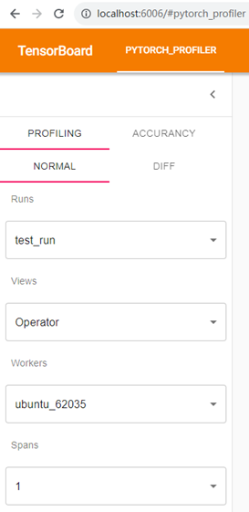

Runs: `--logdir`下包含三层目录的所有数据。

Views: 展示数据分析的多个视图，包含Operator、NPU Kernel、Trace、Memory等多个view。

Workers-Spans: 多线程的情况下Profiling可能包含多组数据，通过Workers和Spans下拉框来选择不同线程和不同时间采集的数据产生的结果。

* Operator View

    Operator View展示的是运行在host侧和device侧的Pytorch算子、计算算子的详细信息。

    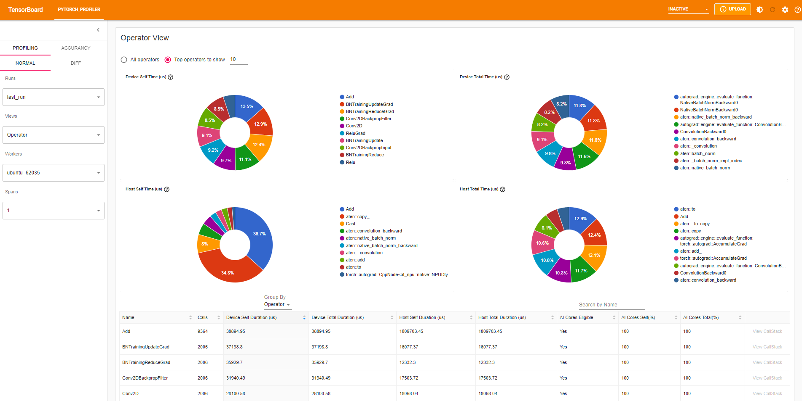

    Calls: 表示的是运行过程中此算子被调用的次数。
    
    Input Shapes: shapes信息。

    Device Self Duration: 算子在device侧的耗时（除去子算子）。

    Device Total Duration: 算子在device侧的耗时。

    Host Self Duration: 算子在host侧的耗时（除去子算子）。

    Host Total Duration: 算子在host侧的耗时。

    AI Cores Eligible: 此算子是否在AICore上运行。

    AI Cores Self (%): 算子在AICore上的耗时（除去子算子） / Device Self Duration。

    AI Cores Total (%):  算子在AICore上的耗时 / Device Total Duration。

    CallStack:  此算子的所有调用堆栈信息.
    说明: 由于一些算子之间存在父子关系（在trace上显示为包含关系），Self表示除去子算子的耗时，Total表示包含所有子算子的耗时。

   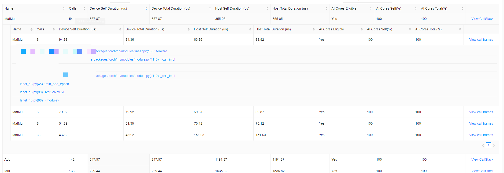

   页面展示了四个饼图和两张表，通过界面的Group By切换表格和饼图。当切换为Operator时，表格已算子名称的维度进行展示，点击某个算子
   的View CallStack后，此算子会按照Call Stack分类展示算子信息。点击View call frames可以查看算子的调用信息。
   当Group By切换为Operator + Input Shape时，算子以name和Input Shape为维度进行展示。

    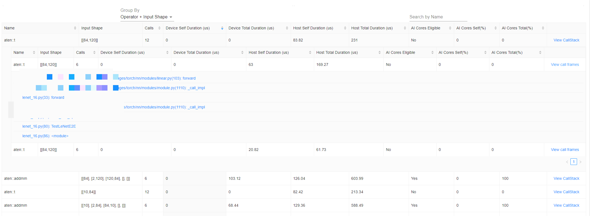

* Kernel View

    Kernel View展示算子在加速核上运行的详细信息。

    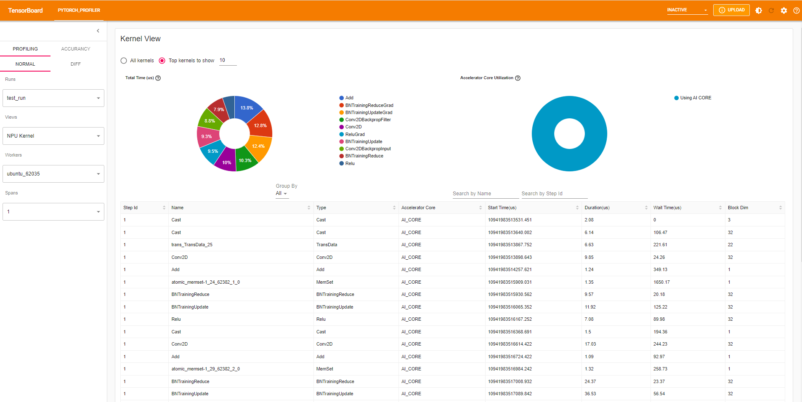

    * Calls: 算子调度的次数。
  
    * Accelerator Core: 计算核。
  
    * Block Dim: Task运行切分数量，对应Task运行时核数。

    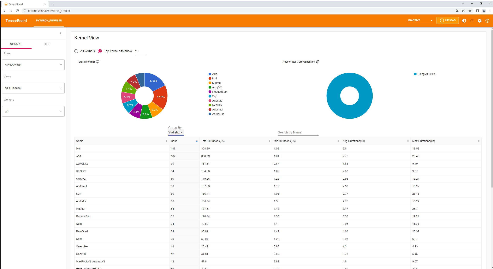

    * Operator: 运行在npu上的算子名称。

    * Accelerator Core Utilization: 算子执行在各类core上耗时百分比。

    * Total Duration、 Max Duration、Avg Duration、Min Duration: 算子调用总耗时、最大耗时、平均耗时以及最小耗时。
    
    此视图包含两张饼图和两张表，可通过Group By切换表格数据：算子的详细表以及统计表。

* Trace View

    此视图显示使用chrome插件，展示在整个训练过程中的时序图。

    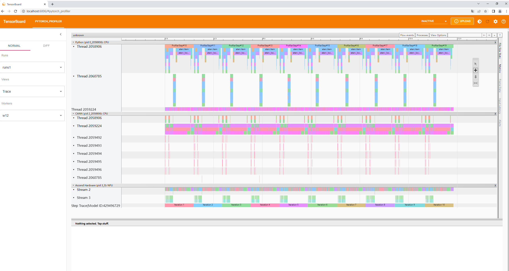

    Trace View主要包含三个层级以及层级下各个线程上执行的算子的时序排布。

    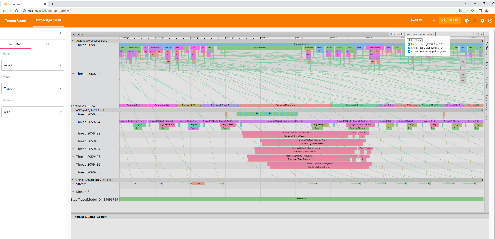

    目前主要包括三个层级，PTA、CANN和Ascend Hardware。可以通过选择Processes来选择要展示的层级。

    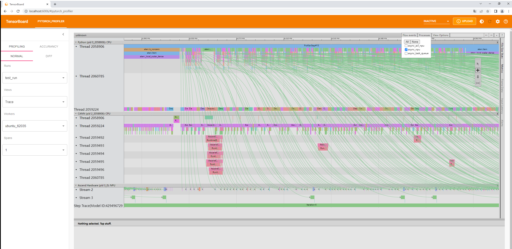

    选择只展示async_nup，可以查看框架侧算子与昇腾硬件上执行的算子的关联关系。

    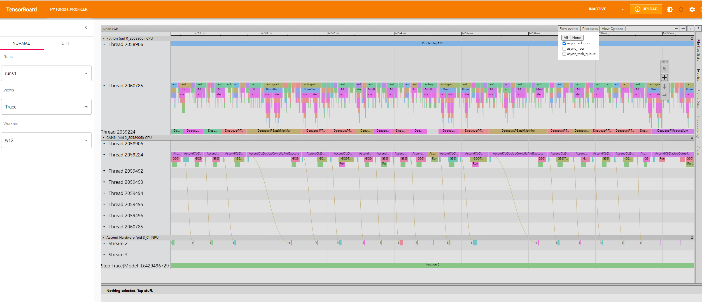

    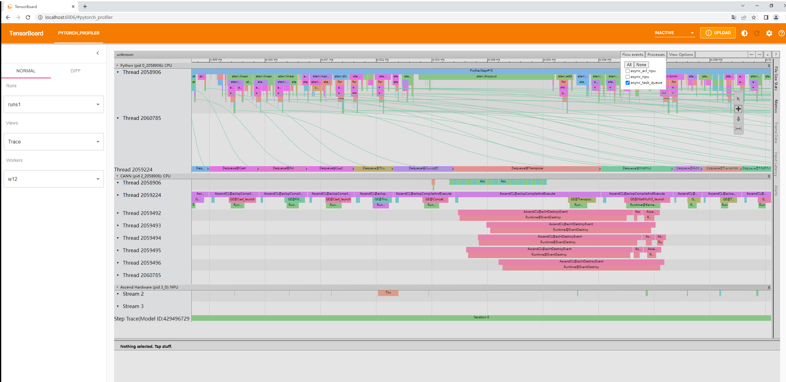

* Memory View

    展示的是Pytorch Profiler执行过程中算子级内存申请和释放的信息。

    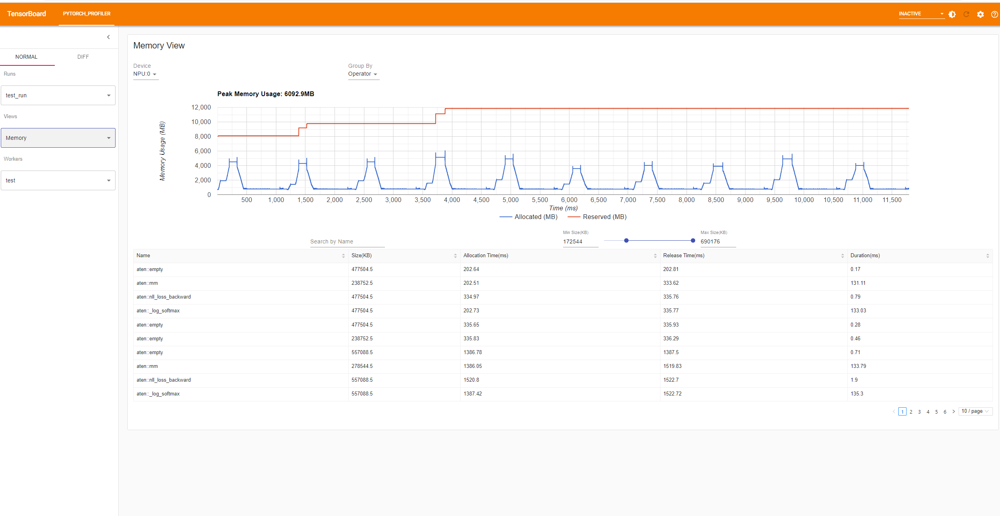
    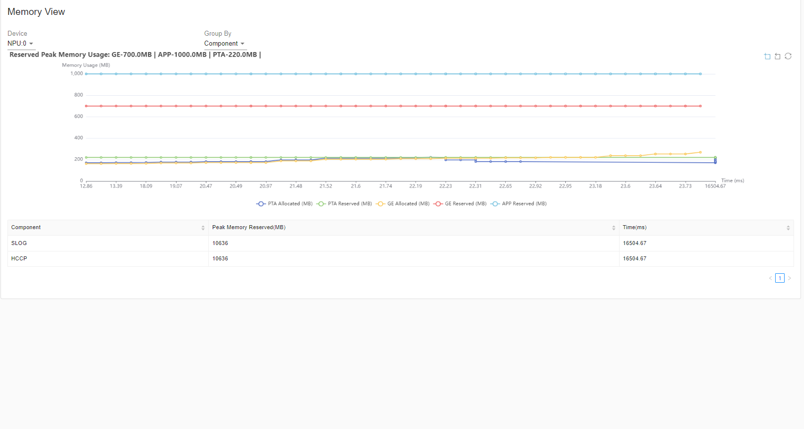

    主要包括两张折线图和两张表。可以在 'Device' 下拉框下选择要展示的NPU卡的内存使用信息。Group By可以切换总的内存使用和各个组件内存使用图表。

    * Operator

      整个推理过程中，内存使用情况汇总。

      表格数据代表含义:

      * Name: 组件侧算子名称（PTA等）。

      * Size: 申请的内存大小。

      * Allocation Time: 内存申请时间。

      * Release Time: 内存释放时间。

      * Duration: 内存持有时间。

    * Component

      图展示的是PTA和GE组件内存使用，表格为各个组件内存使用峰值。

* Diff View

    Diff视图提供了Profiling数据比对功能。适用于同一网络不同迭代之间采集数据比对算子耗时情况，网络进行优化前后相同位置算子耗时情况比对、单机多卡不同卡之间采集数据比对以及相同网络不同硬件平台上运行性能情况比对等场景。
    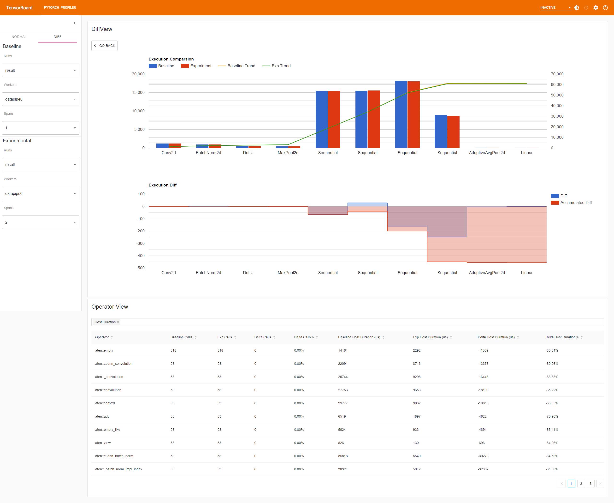
    
    * 最上方为整体比对，以采集的step为周期比较两份数据各类算子的耗时情况以及累计耗时变化趋势。点击其中某块柱形，可以单点查看对应详情。
    
     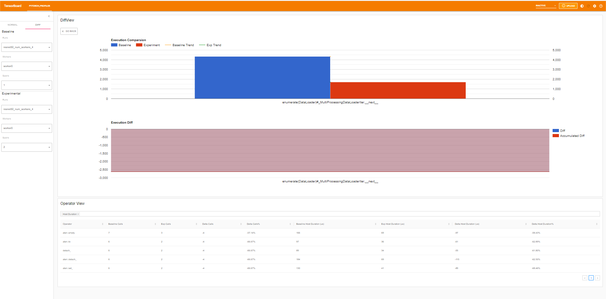

    * 中间视图为差异图，由红蓝两块区域构成。横坐标与上方视图对应，蓝色区域为每类算子的耗时差值，红色区域表示当前所有算子耗时差的累加值。

    * 最下方为算子比对明细表，显示相关差值以及相差比例信息。由于数据条目较多，支持选择是否显示Host Duration、Self Host Duration、Device Duration以及Self Device Duration相关比对信息。
        * Host Duration：算子在Host侧的累计耗时，包括子算子耗时。
        * Self Host Duration：算子在Host侧的累计耗时，不包括子算子耗时。
        * Device Duration：算子在Device侧的累计耗时，包括子算子耗时。
        * Self Device Duration：算子在Device侧的累计耗时，不包括子算子耗时。

* Distributed View

    Distributed视图展示的是多卡采集数据情况，包括每张卡的计算、通信信息以及通信算子的详细信息，界面由两张柱状图和一个通信算子信息表构成，如下图。
    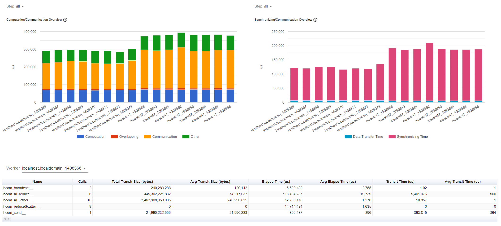
    
    * 左侧柱状图呈现了每张卡计算和通信等项的耗时，各项定义如下：

    | 字段 | 含义 |
    |------|------|
    | Computation   | 计算时间：在NPU上的计算时间减去和通信重叠的时间。|
    | Communication | 通信时间：总通讯时间减去和计算重叠的时间。|
    | Overlapp      | 重叠时间：计算和通信重叠的时间。此项占比越大代表计算和通信的并行性越好，理想情况下计算和通信完全重叠。|
    | Other         | 除去计算和通信的其他部分耗时，包括初始化、数据加载等。|
    
    * 右侧柱状图将通信时间分为数据传输时间和同步时间进行统计，定义如下：
    
    | 字段 | 含义 |
    |------|------|
    | Data Transfer Time | 通信时间中实际的数据传输时间。     |
    | Synchronizing Time | 通信时间中等待以及和其他卡同步的时间。 | 

    * 界面下方为通信算子信息表，统计了各张卡的通信算子详情。

    | 字段 | 含义 |
    |------|------|
    | Name | 通信算子名称       |
    | Calls | 调用次数。        |
    | Total Transit Size(bytes) | 传输的总数据大小。    |
    | Avg Transit Size(bytes) | 平均每次传输的数据大小。 |
    | Elapse Time(us) | 此类算子总耗时。     |
    | Avg Elapse Time(us) | 单个算子平均耗时。    |
    | Transit Time(us) | 此类算子传输总耗时。   |
    | Avg Transit Time(us) | 单个算子平均传输耗时。  |