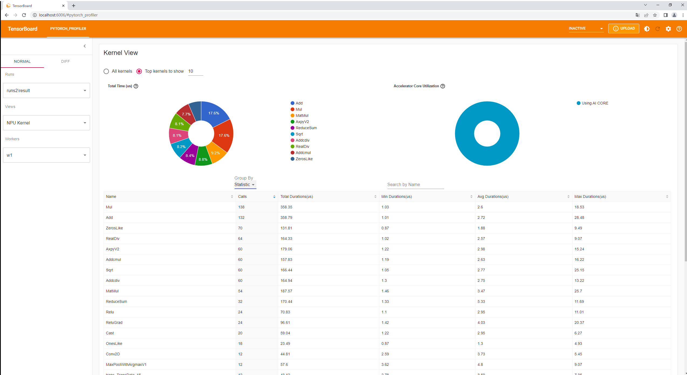
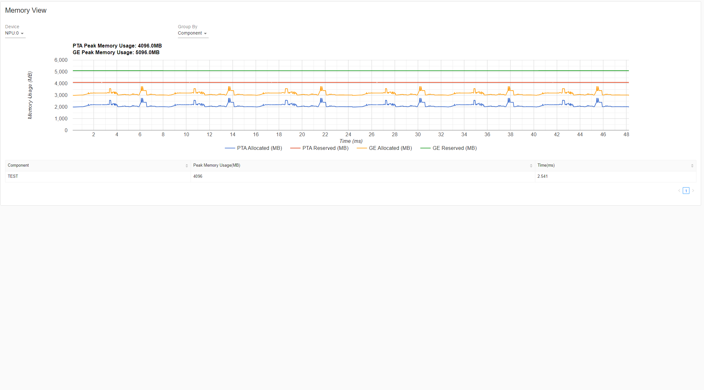

# PyTorch Profiler TensorBoard NPU Plugin

此工具是PyTorch profiling数据可视化的TensorBoard的插件。
它支持将Ascend平台采集、解析的Pytorch Profiling数据可视化呈现，也兼容GPU数据采集、解析可视化。

### 快速安装说明
1. 插件方式安装

* 安装相关依赖：
  pandas >= 1.0.0 ，tensorboard >= 1.15, != 2.1.0
* 使用依赖：
  torch >= 1.8，
  torchvision >= 0.8

* 插件形式为whl包，使用指令安装

  `pip install torch-tb-profiler_npu_0.4.0_py3_none_any.whl`

2. 从源代码安装

* 从仓库下载源码:

  `git clone https://gitee.com/ascend/amtt`

*  进入目录 `/tb_plugins/profiling/tb_plugin` 下.

*  执行安装命令:

  `pip install .`
* 构建whl包
  - `python setup.py build_fe sdist bdist_wheel` \
   注意: build_fe步骤需要setup yarn和Node.js
  - `python setup.py sdist bdist_wheel`

  在 `/tb_plugins/profiling/tb_plugin/dist` 目录下取出whl包，使用方式1进行安装
### 

* 准备profiling数据
  
  需要在读取的目录下放置指定格式的profiling数据。格式为包含3个层级的目录结构：runs层级为最外层目录（我们将一个完整的Profiling数据视为一个runs\
  进行可视化处理），其子目录为worker_span层级（命名格式为{worker}_{span}），下一层级为规定命名的ASCEND_PROFILER_OUTPUT目录，此目录中包含\
  此插件加载展示的数据文件，如trace_view.json、kernel_details.csv、operator_details.csv等。目录结构如下：
*  E.g. there are 2 runs: run1, run2 \
            `run1` \
                `--[worker1]_[span1]` \
                    `----ASCEND_PROFILER_OUTPUT` \
                        `------trace_view.json` \
                        `------kernel_details.csv` \
                `--[worker2]_[span1]` \
                    `----ASCEND_PROFILER_OUTPUT` \
                        `------trace_view.json` \
                        `------operator_details.csv` \
            `run2` \
                `--[worker1]_[span1]` \
                    `----ASCEND_PROFILER_OUTPUT` \
                        `------memory_record.csv` \
                        `------operator_memory.csv` 
  
* 启动TensorBoard

  `tensorboard --logdir=./samples`

  如果网络浏览器与启动TensorBoard的机器不在同一台机器上，则需要在尾部加上`--bind_all`命令，如：

  `tensorboard --logdir=./samples --bind_all`

  注意：确保默认端口6006对浏览器的主机打开。

  如果需要切换端口号需要在尾部加上指定的端口号`--port=6007`

  `tensorboard --logdir=./samples --port=6007`

* 在浏览器上打开tensorboard

  在浏览器中打开URL： `http://localhost:6006`。
  如果tensorboard启动命令使用`--bind_all` , 主机名不是`localhost`，而是绑定的主机ip，可以在cmd之后打印的日志中查找。

* PYTORCH_PROFILER选项卡

  如果`--logdir` 下的文件太大或太多，请等候，刷新浏览器查看加载结果。

### 页面展示说明

  页面加载完成后，左侧视图如图。每个Runs都对应于`--logdir`指定的文件夹下的一个子文件夹（三层目录中的第一层run1, run2等）。
  每个子文件夹包含一个或多个profiling数据文件夹。

Runs: `--logdir`下包含三层目录的所有数据。

Views: 展示数据分析的多个视图，包含Operator、NPU Kernel、Trace、Memory等多个view。

Workers-Spans: 多线程的情况下Profiling可能包含多组数据，通过Workers和Spans下拉框来选择不同线程和不同时间采集的数据产生的结果。

* Operator View

    Operator View展示的是运行在host侧和device侧的Pytorch算子、计算算子的详细信息。

    

    Calls: 表示的是运行过程中此算子被调用的次数。
    
    Input Shapes: shapes信息。

    Device Self Duration: 算子在device侧的耗时（除去子算子）。

    Device Total Duration: 算子在device侧的耗时。

    Host Self Duration: 算子在host侧的耗时（除去子算子）。

    Host Total Duration: 算子在host侧的耗时。

    AI Cores Eligible: 此算子是否在AICore上运行。

    AI Cores Self (%): 算子在AICore上的耗时（除去子算子） / Device Self Duration。

    AI Cores Total (%):  算子在AICore上的耗时 / Device Total Duration。

    CallStack:  此算子的所有调用堆栈信息.
    说明: 由于一些算子之间存在父子关系（在trace上显示为包含关系），Self表示除去子算子的耗时，Total表示包含所有子算子的耗时。

   

   页面展示了四个饼图和两张表，通过界面的Group By切换表格和饼图。当切换为Operator时，表格已算子名称的维度进行展示，点击某个算子
   的View CallStack后，此算子会按照Call Stack分类展示算子信息。点击View call frames可以查看算子的调用信息。
   当Group By切换为Operator + Input Shape时，算子以name和Input Shape为维度进行展示。

    

* Kernel View

    Kernel View展示算子在加速核上运行的详细信息。

    

    * Calls: 算子调度的次数。
  
    * Accelerator Core: 计算核。
  
    * Block Dim: Task运行切分数量，对应Task运行时核数。

    

    * Operator: 运行在npu上的算子名称。

    * Accelerator Core Utilization: 算子执行在各类core上耗时百分比。

    * Total Duration、 Max Duration、Avg Duration、Min Duration: 算子调用总耗时、最大耗时、平均耗时以及最小耗时。
    
    此视图包含两张饼图和两张表，可通过Group By切换表格数据：算子的详细表以及统计表。

* Trace View

    此视图显示使用chrome插件，展示在整个训练过程中的时序图。

    

    Trace View主要包含三个层级以及层级下各个线程上执行的算子的时序排布。

    

    目前主要包括三个层级，PTA、CANN和Ascend Hardware。可以通过选择Processes来选择要展示的层级。

    

    选择只展示async_nup，可以查看框架侧算子与昇腾硬件上执行的算子的关联关系。

    

    

* Memory View

    展示的是Pytorch Profiler执行过程中算子级内存申请和释放的信息。

    
    

    主要包括两张折线图和两张表。可以在 'Device' 下拉框下选择要展示的NPU卡的内存使用信息。Group By可以切换总的内存使用和各个组件内存使用图表。

    * Operator

      整个推理过程中，内存使用情况汇总。

      表格数据代表含义:

      * Name: 组件侧算子名称（PTA等）。

      * Size: 申请的内存大小。

      * Allocation Time: 内存申请时间。

      * Release Time: 内存释放时间。

      * Duration: 内存持有时间。

    * Component

      图展示的是PTA和GE组件内存使用，表格为各个组件内存使用峰值。